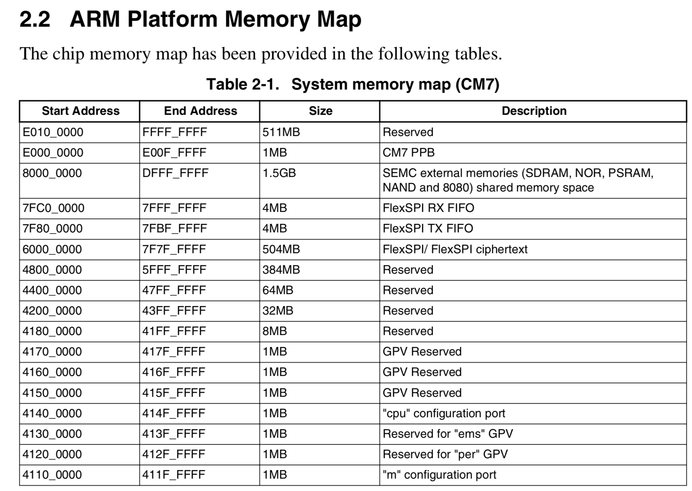

#### RT1052调查
- System Memory map


- 工程文件中两个文件关于memory map地址
    - ini文件
        ```FUNC void Setup (void) {
            SP = _RDWORD(0x60002000);          // Setup Stack Pointer
            PC = _RDWORD(0x60002004);          // Setup Program Counter
            _WDWORD(0xE000ED08, 0x60002000);   // Setup Vector Table Offset Register
            }

            FUNC void OnResetExec (void)  {      // executes upon software RESET
            Setup();                           // Setup for Running
            }

            LOAD %L INCREMENTAL                  // Download

            Setup();                             // Setup for Running

            // g, main
        ```
    - scf文件
        >#define m_interrupts_start             0x60002000
        #define m_interrupts_size              0x00000400

        >#define m_text_start                   0x60002400
        #define m_text_size                    0x1F7FDC00

        >#define m_data_start                   0x20000000
        #define m_data_size                    0x00020000

    - ld文件
        >/* Specify the memory areas */
MEMORY
{
  m_interrupts          (RX)  : ORIGIN = 0x60002000, LENGTH = 0x00000400
  m_text                (RX)  : ORIGIN = 0x60002400, LENGTH = 0x1F7FDC00
  m_data                (RW)  : ORIGIN = 0x20000000, LENGTH = 0x00020000
}
   - Reset Handler
    ```Reset_Handler   PROC
                EXPORT  Reset_Handler             [WEAK]
                IMPORT  SystemInit
                IMPORT  __main

                CPSID   I               ; Mask interrupts
                LDR     R0, =0xE000ED08 ; 对应了ini文件中的地址去，这个地方是CM7 PPB的1MB地址空间，保存PC指针用
                LDR     R1, =__Vectors
                STR     R1, [R0]    ; R1= 0x60002000
                LDR     R2, [R1]    ; 将0x60002000地址下的内容赋给R2
                MSR     MSP, R2     ; 设置main stack pointer 主栈指针,复位后缺省使用的栈指针，用于操作系统内核以及异常处理程序(包括中断服务程序)
                LDR     R0, =SystemInit
                BLX     R0
                CPSIE   i               ; Unmask interrupts
                LDR     R0, =__main
                BX      R0
                ENDP
    
    ```
    ```IMPORT  |Image$$ARM_LIB_STACK$$ZI$$Limit|
        __Vectors       DCD     |Image$$ARM_LIB_STACK$$ZI$$Limit| ; Top of Stack
                        DCD     Reset_Handler  ; Reset Handler,对应了PC指针
                        DCD     NMI_Handler                         ;NMI Handler
                        DCD     HardFault_Handler                   ;Hard Fault Handler
                        DCD     MemManage_Handler                   ;MPU Fault Handler
                        DCD     BusFault_Handler                    ;Bus Fault Handler
                        DCD     UsageFault_Handler                  ;Usage Fault Handler
                        DCD     0                                   ;Reserved

    ```
- 为了能够让一个nor flash支持2个image的启动，需要做的事情
    - ini的设定(往后32MB)
        > SP = _RDWORD(0x62002000);          // Setup Stack Pointer
            PC = _RDWORD(0x62002004);          // Setup Program Counter
            _WDWORD(0xE000ED0C, 0x62002000);   // Setup Vector Table Offset 
    - scf文件的设定
        >#define m_interrupts_start             0x62002000
        #define m_interrupts_size              0x00000400

        >#define m_text_start                   0x62002400
        #define m_text_size                    0x1F7FDC0
    - startup_MIMXRT1052.s文件修改
        ``` 
          if sel_rom_offset1 == true
           LDR     R0, =0xE000ED08 
          else
           LDR     R0, =0xE000ED0C 
          endif
        ```
    - 烧录image1到nor flash的0x00000000地址下，烧录image2到nor flash的0x02000000地址下（烧录工具能否实现？）
    - 其他
        - 如果0xE000ED0C地址空间已经被占用，那么startup_MIMXRT1052.s文件的修改方式要变更，宗旨就是image2场景下把__Vectors和MSP赋值为偏移32MB后的地址
