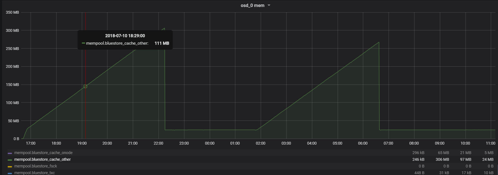
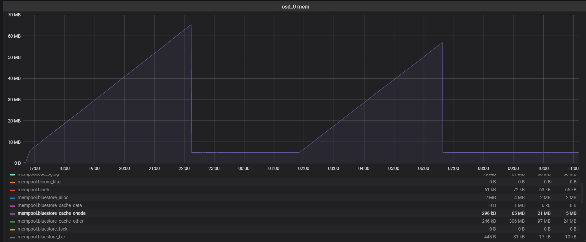
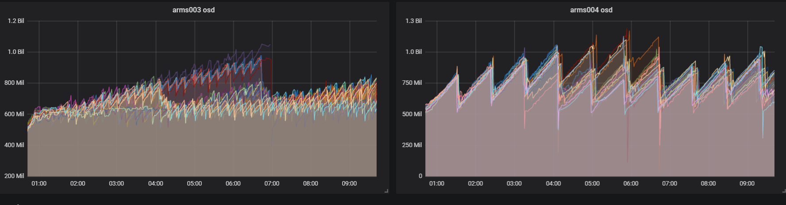
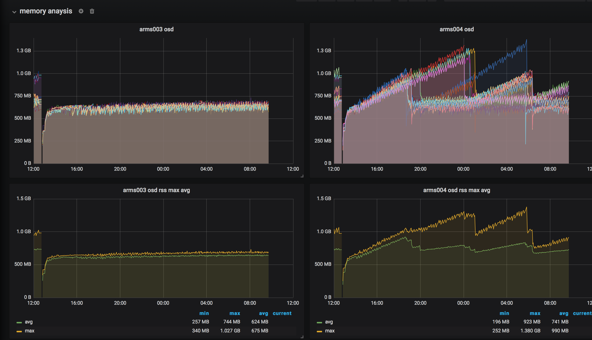

- ceph架构
    
    - 自己的理解
        - rbd
            - 块存储，提供卷服务
            - 用户态
                - librbd.so通过QEMU Driver给KVM虚拟机使用
            - 内核态
                - rbd.ko内核模块和librbd.so，给物理主机使用
        - cephfs
            - 提供文件系统服务（NFS/CIFS）
            - libcephfs.so
            - posix接口
        - rgw
            - 提供对象存储接口
            - Amazon S3
            - OpenStack Swift
- 存储知识
    - NAS
        - Network Attached Storge
        - 本质上相当于File Server，通常支持TCP/IP，提供NFS、SAMBA、FTP等常见通讯协议，让用户获取档案系统。
        - 有Web管理界面，管理磁盘网络等
    - SAN
        - Storge Area Network
        - 可看作外接式存储设备，提供磁盘给主机使用
- osd调试log
	```
	debug filestore = 20
	debug journal = 20
	debug osd = 20
	debug_objecter = 20
	debug_journaler = 20
	debug_objectcacher = 20
	debug_objclass = 20
	debug_optracker = 20
	"filestore_journal_writeahead": "false",
	"filestore_journal_parallel": "false",
    "filestore_journal_trailing": "false",
    "filestore_journal_writeahead": "false"
	```
- ceph config setting dynamically
    - ceph daemon osd.46 config set debug_bluestore 1/20
- ceph heap dump
    - /usr/bin/python2.7 /usr/bin/ceph daemon osd.47 heap stats
- ceph mempool dump
    - ceph daemon osd.46 dump_mempools
- memory profiling
    - sudo apt-get install google-perftools
    - ceph tell osd.46 heap start_profiler
    - ceph tell osd.46 heap dump
    - ceph tell osd.46 heap stats
    - ceph tell osd.46 heap release
    - ceph tell osd.46 heap stop_profiler
    - pprof --text /usr/bin/ceph-osd  /var/log/ceph/osd.46.profile.0186.heap
    - pprof --pdf /usr/bin/ceph-osd  /var/log/ceph/osd.46.profile.0001.heap > 001.pdf
    - g++ -O0 -g perf_no_leak.cpp -ltcmalloc -o perf_no_leak
    - env LD_PRELOAD="/usr/lib/libtcmalloc.so" HEAPPROFILE="./myheap" HEAP_PROFILE_ALLOCATION_INTERVAL=10000 PERFTOOLS_VERBOSE=99 ./perf_no_leak
    - google-pprof --text ./perf_no_leak ./myheap.0001.heap 
- crushmap 
    - crushmap get
        - ceph osd getcrushmap -o mycrushmap
    - crushmap decompile
        - crushtool -d mycrushmap -o mycrushmap_decompiled
    - crushmap compile
        - crushtool -c mycrushmap_decompiled -o mycrushmap_new
    - crushmap test
        - crushtool -i mycrushmap --test --min-x 1 --max-x 10 --num-rep 3 --ruleset 0 --show_mappings
        - crushtool -i mycrushmap --test --min-x 1 --max-x 100000 --num-rep 3 --ruleset 0 --show_utilization
    - crushmap set
        - ceph osd setcrushmap -i mycrushmap_new 
    - pg distribution perfectly
        - ceph osd set-require-min-compat-client luminous
        - ceph features
        - ceph osd getmap -o om
        - osdmaptool om --upmap out.txt [--upmap-pool <pool>]
        - source out.txt
    - osdmap get
        - ceph osd dump
- PG
    - head对象
        - 原始对象
    - 克隆对象
        - 为了支持快照回滚操作，一般而言可以通过COW机制将原始对象克隆出来一份
    - snapdir对象
        - 如果原始对象被删除，但是仍然被有效的快照引用，显然此时需要借助一个临时对象来保存原始对象的历史信息，以便以后进行快照回滚，这个临时对象称为snapdir
    - 对象的两个关键属性
        - 对象的基本信息
            - OI（Object Info）
            - object_info_t
            - 对象OI属性的磁盘结构
        - 快照信息
            - SS（Snap Set）
            - 对象SS属性的磁盘结构
- Cool Settings
    - osd max write size
    - osd max object size
    - osd client message size cap
- Bluestore
    - Architechiture
     
    - 术语
        - Block-size
            - 磁盘块大小指对磁盘进行操作的最小粒度，例如对机械硬盘而言，这个最小粒度为512个字节，即一个扇区
        - RMW（Read Modify Write）
            - 指当覆盖写发生时，如果本次改写的内容不足一个磁盘大小，那么需要先将对应的块读出来，然后将待修改的内容与原先的内容进行合并，最后将更新后的块重新写入原先的位置
        - COW（Copy-On-Write）
            - 指当覆盖写发生时，不是直接更新磁盘对应位置的已有内容，而是重新再磁盘上分配一块新的空间，用于存放本次新写入的内容，这个过程也称为写时重定向
        - Relationship
            - Bluestore::Extent 
                - 对象内的基本数据管理单元，所以很多扩展功能（数据校验、数据压缩、对象间的数据共享等）都是基于extent粒度实现的
                - logical_offset
                    - 逻辑段起始地址
                - length 
                    - 逻辑段长度
                - blob
                    - 负责将逻辑段的数据映射至磁盘
                - 逻辑地址到磁盘地址的映射路径
                    ```
                    Collection //对应PG在Bluestore当中的内存管理结构
                        BlueStore *store
                        Cache *cache
                        bluestore_cnode_t cnode
                        RWLock lock
                        OnodeSpace onode_map //用于建立Onode和其归属的Collection之间的关系，方便Collection级别操作
                            Cache *cache
                            mempool::bluestore_cache_other::unordered_map<ghobject_t,OnodeRef> onode_map
                        SharedBlobSet shared_blob_set
                            std::mutex lock
                            mempool::bluestore_cache_other::unordered_map<uint64_t,SharedBlob*> 
                    Cache
                        LRUCache
                            onode_lru_list_t onode_lru
                            buffer_lru_list_t buffer_lru
                            add/remove buffer/onode
                            trim
                    Onode //一个Collection本身能够容纳的Onode仅受磁盘空间限制，an in-memory object
                        std::atomic_int nref
                        Collection *c
                        ghobject_t oid
                        bluestore_onode_t onode //onode: per-object metadata
                            uint64_t nid
                            uint64_t size
                            map<mempool::bluestore_cache_other::string, bufferptr> attrs
                            vector<shard_info> extent_map_shards
                        mempool::bluestore_cache_other::vector<Shard> shards
                        ExtentMap extent_map    //同一对象下的所有extents可以进一步组成一个extent map，据此索引本对象下的所有数据
                            Onode *onode
                            blob_map_t spanning_blob_map
                            extent_map_t extent_map
                                Extent
                    Extent //对象内的基本数据的管理单元（管理用户数据的基本单元）
                        uint32_t logical_offset
                        uint32_t blob_offset
                        uint32_t length
                        BlobRef  blob
                    Blob //执行用户数据到磁盘空间映射
                        std::atomic_int nref
                        int16_t id
                        bluestore_blob_use_tracker_t used_in_blob
                        bluestore_blob_t blob
                            PExtentVector extents   //磁盘上物理段的集合
                                mempool::bluestore_cache_other::vector<bluestore_pextent_t> PExtentVector
                                    luestore_pextent_t
                                        offset
                                        length
                            FLAG_SHARED = 16
                        SharedBlobRef
                            std::atomic_int nref
                            CollectionRef coll
                            bluestore_shared_blob_t *persistent //当某个extent的数据被多个extent共享时，用它来表明共享信息（offset、length、refs）
                                uint64_t sbid
                                bluestore_extent_ref_map_t ref_map
                                    mempool::bluestore_cache_other::map<uint64_t,record_t> ref_map;
                            BufferSpace bc
                    BufferSpace //建立每个Blob中用户数据到缓存之间的二级映射
                        state_list_t writing
                        mempool::bluestore_cache_other::map<uint32_t, std::unique_ptr<Buffer>> buffer_map
                            Buffer
                    Buffer //一个Buffer管理Blob当中的一段数据
                        BufferSpace *space
                        uint16_t state
                        uint64_t seq
                        uint32_t offset, length     //mapping to extent
                        bufferlist data             //mapping to extent
                    ```
            - Cache
                - 既可以缓存用户数据也可以缓存元数据(Onode&Buffer)
                - Bluestore可以包含多个Cache实例
            - Collection
                - 对应PG在Bluestore中的内存管理结构，单个Bluestore能管理的Collection数量有限（Ceph推荐每个OSD承载大约100PG），而且Collection管理结构本身比较小巧，所以Collection被设计为常驻内存
            - OnodeSpace
                - 建立Onode和其归属的Collection之间的联系
                - 归属于某个Cache实例
            - Onode 
                - 归属于某个特定的Collection
                - Onode中Extent是管理用户数据的基本单元
                - 一个Collection本身能够容纳的Onode仅受磁盘空间的限制，所以单个Bluestore实例能够管理的Onode数量和其管理的磁盘空间成正比，这决定了通常情况下Onode几乎不可能常驻内存
            - Blob
                - 负责将逻辑段的数据映射至磁盘
                - Blob（对应Extent）是我们操作用户数据的一个基本单位，所以我们对于缓存的操作也是基于BufferSpace，而不是buffer本身
            - SharedBlob
                - 每个blob中包含一个shareBlob用于实现Blob、也就是Extent之间的数据共享。
            - BufferSpace
                - 建立每个Blob中用户数据到缓存之间的二级映射
                - 归属于某个Cache实例
                - 对Blob中的数据进行缓存，并最终纳入Cache管理
            - Buffer
                - 归属于某个BufferSpace实例
                - 一个Buffer管理Blob中的一段数据
    - 关键组件
        - BlockDevice
        - BlueFS
            - BlueStore存储引擎实现中，需要存储数据和元数据，RocksDB来存储元数据，但是BlueStore采用裸设备，RocksDB不支持raw disk，RocksDB提供RocksEnv运行时环境来支持跨平台操作，ceph自己实现了一个简单文件系统只提供RocksEnv需要的操作接口，这样就支持了RocksDB的运行。
        - FreelistManager
            - 因为BlueStore采用裸设备，所以需要自己管理磁盘空间的分配和回收, 如果以block表示磁盘的最小存储单位(Ceph中默认为4k)，一个block的状态可以为使用和空闲两种状态，实现中只需要记录一种状态的block，就可以推导出另一种状态的block。Ceph采用记录空闲状态的block，管理空闲空间的类为FreelistManager
        - Allocator
            - Allocator用来从空闲空间分配block
        - Cache
            - BlueStore自己管理裸设备，没有文件系统，操作系统的page cache利用不上，需要自己管理缓存，包括元数据的缓存和object data的缓存，缓存系统的性能直接影响整个BlueStore的性能
            - 缓存的对象
                - Cnode
                    - pg对应的Collection（常驻内存）
                    - osd负责的pg个数比较少，在osd启动的时候，就会将所有pg对应的Collection加载到内存
                - Onode
                    - object的元信息
                    - 单个osd对应的object成千上万，条件允许可以尽最大可能将object的元信息缓存在内存中
                    - 此类缓存采用LRU策略
                    - Onode 对象的内存结构 -> bluestore_onode_t 对象的磁盘结构
                - Buffer
                    - object data对应的Buffer
                    - 尽可能缓存热点object
                    - 2Q缓存淘汰算法
                - Cache设计上主要面向两种数据类型
                    - 用户数据
                    - Onode
            - Bluestore两大的元数据类型
                - Collection
                - Onode
        - 内存
            - arm集群内存默认的memtable是256MB，因此从内存消耗曲线上来看内存波峰～内存波谷大概约有280MB的差距，内存波峰对应着flush memtable行为，所以之后的内存有一个有一个直线下降
    - 存储空间
        - 慢速（Slow）空间
            - 这类空间主要用于存储对象数据可由普通大容量机械磁盘提供，由BlueStore自行管理
        - 高速（DB）空间
            - 存储BlueStore内部产生的元数据（例如onode），由BlueFS管理
        - 超高速（WAL）空间
            - 存储RocksDB内部产生的.log文件，由BlueFS管理
    - 代码
        - MEMPOOL_DEFINE_OBJECT_FACTORY可以查看entity申请的内存在哪一个memorypool
- linux
    - memory分配策略
        - sysctl -w vm.swappiness=60
        - sysctl -w vm.overcommit_memory=2
        - sysctl -w vm.overcommit_ratio=70
    - swap分区
        - dd if=/dev/zero of=/home/swap bs=1024 count=2048000
        - mkswap /home/swap
        - swapon /home/swap
    - 修改IO
        - echo 'noop' > /sys/block/rbd0/queue/scheduler 
            - defautl echo [none] > /sys/block/rbd0/queue/scheduler 
        - echo 1024 > /sys/block/rbd0/queue/nr_requests
            - default echo 128 > /sys/block/rbd0/queue/nr_requests
- 磁盘
    - 为何随机是关注IOPS，顺序关注吞吐量？
        - 因为随机读写的话，每次IO操作的寻址时间和旋转延时都不能忽略不计，而这两个时间的存在也就限制了IOPS的大小；而顺序读写可以忽略不计寻址时间和旋转延时，主要花费在数据传输的时间上。
    - 分区
        parted分区
        parted /dev/sda
        mklabel gpt
        mkpart
        分区名称？  []?     		//设置分区名
        文件系统类型？  [ext2]?      	//直接回车
        起始点？ 0   			//分区开始
        结束点？ -1   			//分区结束 -1为全部硬盘空间
        (parted) p   			//查看分区结果
        mkfs.xfs -f /dev/sda1		//格式化分区
- ROCKSDB
    - 数据库
        - 数据库往往是一个比较丰富完整的系统, 提供了SQL查询语言，事务和水平扩展等支持
    - 存储引擎
        - 专注于单机的读/写/存储。一般来说, 数据库底层往往会使用某种存储引擎。
    - LEVELDB
        - MemTable
            - 即内存中的SSTable，新数据会写入到这里，然后批量写入磁盘，以此提高写的吞吐量
        - Log文件
            - 写MemTable前会写Log文件，即用WAL(Write Ahead Log)方式记录日志，如果机器突然掉电，内存中的MemTable丢失了，还可以通过日志恢复数据。
        - Immutable MemTable
            - 内存中的MemTable达到指定的大小后，将不再接收新数据，同时会有新的MemTable产生，新数据写入到这个新的MemTable里，Immutable MemTable随后会写入硬盘，变成一个SST文件。
        - SSTable文件
            - 即硬盘上的SSTable，文件尾部追加了一块索引，记录key->offset，提高随机读的效率。SST文件为Level 0到Level N多层，每一层包含多个SST文件；单个SST文件容量随层次增加成倍增长；Level0的SST文件由Immutable MemTable直接Dump产生，其他Level的SST文件由其上一层的文件和本层文件归并产生
        - Manifest文件
            -  Manifest文件中记录SST文件在不同Level的分布，单个SST文件的最大最小key，以及其他一些LevelDB需要的元信息
        - Current文件
            - 从上面的介绍可以看出，LevelDB启动时的首要任务就是找到当前的Manifest，而Manifest可能有多个。Current文件简单的记录了当前Manifest的文件名
        - 参考
            - https://soulmachine.gitbooks.io/system-design/content/cn/key-value-store.html
- boost
    - boost::intrusive_ptr
        - 一种“侵入式”的引用计数指针，它实际并不提供引用计数功能，而是要求被存储的对象自己实现引用计数功能，并提供intrusive_ptr_add_ref和intrusive_ptr_release函数接口供boost::intrusive_ptr调用
- 汇编
    - lea
        - load effective address
            - 取有效地址，也就是取偏移地址
        ```
            SI=1000H , DS=5000H, (51000H)=1234H
            执行指令 LEA BX , [SI]后，BX=1000H
            执行指令 MOV BX , [SI]后，BX=1234H
        ```
    - 
- C++
    - 左值
        - 赋值操作符“=”的左侧，通常是一个变量
    - 右值
        - 赋值操作符“=”的右侧，通常是一个常数、表达式、函数调用
    - 移动语义
        - 右值引用支持移动语义的实现，这可以显著提高应用程序的性能。 利用移动语义，您可以编写将资源（如动态分配的内存）从一个对象转移到另一个对象的代码。 移动语义很有效，因为它使资源能够从无法在程序中的其他位置引用的临时对象转移。
    - 右值引用
        - 右值引用，是对临时对象的一种引用，它是在初始化时完成引用的，但是右值引用不代表引用临时对象后就不能改变右值引用所引用对象的值，仍然可以在初始化后改变临时对象的值。
        - 对于引用类型，可以用于它所引用对象类型的可以用的地方（把它当成普通变量），只不过用到的值是它所引用的对象的值，它还可以用于移动构造或赋值函数的地方
    - default member functions
        ```
        class Thing {
            public:
                Thing();                        // default constructor
                Thing(const Thing&);            // copy c'tor
                Thing& operator=(const Thing&); // copy-assign
                ~Thing();                       // d'tor
                // C++11:
                Thing(Thing&&);                 // move c'tor
                Thing& operator=(Thing&&);      // move-assign
        };
        ```
    - 类型转换
        - dynamic_cast
            - 将基类类型对象的引用或指针转换为同一继承层次中其他类型的引用或指针。
            - dynamic_cast操作符一次执行两个操作。它首先验证被请求的转换是否有效，只有转换有效，操作符才实际转换
        - const_cast
            - 转换掉表达式的const性质
        - static_cast
            - 编译器隐式执行的任何类型转换都可以有static_cast显式完成。
            - 当需要将一个较大的算术类型赋值给较小的类型时，使用强制类型转换非常有用
            - 如果编译器不提供自动转换，使用static_cast来执行类型转换也是非常有用
        - reinterpret_cast
            - 通常作为操作数的位模式提供较低层次的重新解释
    - typedef和#define
        - #define is a preprocessor token: the compiler itself will never see it.
        - typedef is a compiler token: the preprocessor does not care about it.
        - example
            ```
            typedef int* int_p1;
            int_p1 a, b, c;  // a, b, and c are all int pointers.
            #define int_p2 int*
            int_p2 a, b, c;  // only the first is a pointer!
            ```
        - https://stackoverflow.com/questions/1666353/are-typedef-and-define-the-same-in-c
    - 宏定义
        - __attribute__((aligned(x)))
            - 按照字节对齐
        - #和##
            - \# 字符串化
            - \#\# 字符串拼接
    - override关键字
        + 1. 公有继承
            + 1.1 纯虚函数    =>  继承的是：接口 (interface)
            + 1.2 普通虚函数    =>  继承的是：接口 + 缺省实现 (default implementation)
            + 1.3 非虚成员函数  =>  继承的是：接口 + 强制实现 (mandatory implementation)
        + 2. 不要重新定义一个继承自基类的非虚函数 (never redefine an inherited non-virtual function)
        + 3. C++11 中的 override 关键字，可以显式的在派生类中声明，哪些成员函数需要被重写，如果没被重写，则编译器会报错。
        + 4. https://www.cnblogs.com/xinxue/p/5471708.html
    - Boost.Intrusive
        - https://www.boost.org/doc/libs/1_47_0/doc/html/intrusive/usage.html#intrusive.usage.usage_base_hook
        - 本质上可以看成是一个侵入式list
        - typedef boost::intrusive::list<MyClass, boost::intrusive::member_hook< MyClass, boost::intrusive::list_member_hook<>, boost::intrusive::list_member_hook<>>> MemberList;
        - intrusive ptr
            - https://blog.csdn.net/caimouse/article/details/8631381
            - 需要自己实现引用计数+/-的函数intrusive_ptr_add_ref，intrusive_ptr_release
    - try trhow catch
        - try语句包含一个trhow语句，catch语句进行捕获和异常处理
        - https://www.cnblogs.com/wujing-hubei/p/5440361.html
    - main函数
        - main函数的返回值只能是int，而不能是void
    - emplace_front、emplace和emplace_back
        - emplace相关函数可以减少内存拷贝和移动。当插入rvalue，它节约了一次move构造，当插入lvalue，它节约了一次copy构造。
        - https://blog.csdn.net/fengbingchun/article/details/78670376
    - Alloctator
        - 为什么要有alloctor？
            - 区别于关键字new，alloctator分离了内存分配和对象构造，同理delete
            - 相当于申请了一大块地，之后建造自己想要的房子，而不是分配地和建造房子同时进行。
            - https://www.cnblogs.com/joeylee97/p/8656510.html
    - new
        - new = operator new分配空间 + placement new调用construct + 返回对象指针
        - placement new
            - 在一块已经获得的内存里建立一个对象
            - 不可以被重写
        - https://blog.csdn.net/pfgmylove/article/details/8234360
    - C++标准库与C++11
        - In the C++ programming language, the C++ Standard Library is a collection of classes and functions, which are written in the core language and part of the C++ ISO Standard itself
        - C++11 is a version of the standard for the programming language C++. It was approved by International Organization for Standardization (ISO) on 12 August 2011, replacing C++03,[1] superseded by C++14 on 18 August 2014[2] and later, by C++17.
        - g++ command 
            - -std=<value>      Language standard to compile for
            - -stdlib=<value>   C++ standard library to use
        - gcc、libc、libstdc++
            - gcc
                - GCC发布的同时，可能更新libstdc++库，来满足更新的C++标准
                - 例如GCC7.1开始支持c++17
            - libc++ 
                - 是C++标准库
                - libc++ on Mac OS X（针对clang编译器）
            - libstdc++ 
                - 是C++标准库
                - libstdc++ on GNU/Linux 
                - libstdc++首先是会与glibc交互，才能和内核通信
            - libc
                - C标准库
                - hello world时包含的头文件#include <stdio.h> 定义的地方
            - glibc
                - GNU C Library，逐渐取代了libc
                - glibc是Linux系统中最底层的API，几乎其它任何的运行库都要依赖glibc。 glibc最主要的功能就是对系统调用的封装
                - 除了封装系统调用，glibc自身也提供了一些上层应用函数必要的功能,如string,malloc,stdlib,linuxthreads,locale,signal等等
            - eglibc
                - 这里的e是Embedded的意思，也就是前面说到的变种glibc
            - https://blog.csdn.net/haibosdu/article/details/77094833
    - backtrace
        - int backtrace(void **buffer,int size) 
            - 该函数用于获取当前线程的调用堆栈,获取的信息将会被存放在buffer中,它是一个指针列表。
        - char ** backtrace_symbols (void *const *buffer, int size)
            - backtrace_symbols将从backtrace函数获取的信息转化为一个字符串数组. 参数buffer应该是从backtrace函数获取的指针数组,size是该数组中的元素个数(backtrace的返回值)   
        - 可以自己定义类似ceph_abort，内部调用backtrace相关函数，后调用assert函数，这样能在程序退出前打印线程的函数调用堆栈
        - https://www.cnblogs.com/lidabo/p/5344768.html
    - C++提取函数名的工具
        > c++filt _ZNK4Json5ValueixEPKc
        > Json::Value::operator[](char const*) const
    - 预处理、编译、汇编、链接
        - 预处理过程主要处理那些源代码文件中以“#”开始的预编译指令。比如“#inlucde”、“#define”等，经过预处理后的.i文件不包含任何宏定义
        - 编译过程，通过编译器把编译器预处理完生成的.i文件，进行一系列词法分析、语法分析、语义分析及优化后生成相应的汇编代码文件.S
        - 汇编过程，通过汇编器把汇编代码转变成机器可以执行的指令，生成目标文件.o
        - 链接过程，通过链接器把目标文件.o链接成库/可执行文件
    - STL容器
        - 顺序容器
            - 顺序容器的元素排列次序与元素值无关，而是由元素添加到容器里的次序决定
            - vector(向量)、list（列表）、deque（队列）
        - 关联容器
            - 关联式容器是非线性的树结构，更准确的说是二叉树结构。各元素之间没有严格的物理上的顺序关系
            - map（集合）、set（映射）、multimap（多重集合）、multiset（多重映射）
        - vector
            - 数组
            - 相当于数组，但其大小可以不预先指定，并且自动扩展。它可以像数组一样被操作，由于它的特性我们完全可以将vector 看作动态数组。在创建一个vector后，它会自动在内存中分配一块连续的内存空间进行数据存储，初始的空间大小可以预先指定也可以由vector默认指定，这个大小即capacity()函数的返回值。当存储的数据超过分配的空间时vector 会重新分配一块内存块，但这样的分配是很耗时的，
        - list
            - 双向循环链表
            - 是一个线性链表结构，它的数据由若干个节点构成，每一个节点都包括一个信息块（即实际存储的数据）、一个前驱指针和一个后驱指针。它无需分配指定的内存大小且可以任意伸缩，这是因为它存储在非连续的内存空间中，并且由指针将有序的元素链接起来。
        - deque
            - 数组
            - 它不像vector 把所有的对象保存在一块连续的内存块，而是采用多个连续的存储块，并且在一个映射结构中保存对这些块及其顺序的跟踪。向deque 两端添加或删除元素的开销很小，它不需要重新分配空间。
        - set
            - 基于红黑树(RB-tree)
            - 按照键进行排序存储， 值必须可以进行比较， 可以理解为set就是键和值相等的map
            - 里面的元素都是排序好的，支持插入，删除，查找等操作，就像一个集合一样。所有的操作的都是严格在logn时间之内完成，效率非常高。
        - mulset
            - 基于红黑树(RB-tree)
            - set和multiset的区别是：set插入的元素不能相同，但是multiset可以相同。
        - map
            - 基于红黑树(RB-tree)
            - 键唯一
            - 元素按键升序排列
            - map是关联容器，容器中每一个元素都是一个键和一个值组成的。
            - end()函数，指向理论上的末尾元素，并不是一个真正的最后元素，最后一个元素是--map.end()
        - mulmap
            - 基于红黑树(RB-tree)
            - map与multimap差别仅仅在于multiple允许一个键对应多个值
        - 容器类自动申请和释放内存，因此无需new和delete操作
        - 使用原则
            - 如果需要高效的随机存取，不在乎插入和删除的效率，使用vector；
            - 如果需要大量的插入和删除元素，不关心随机存取的效率，使用list；
            - 如果需要随机存取，并且关心两端数据的插入和删除效率，使用deque；
            - 如果打算存储数据字典，并且要求方便地根据key找到value，一对一的情况使用map，一对多的情况使用multimap；
            - 如果打算查找一个元素是否存在于某集合中，唯一存在的情况使用set，不唯一存在的情况使用multiset；
            - 查找问题，unordered_map会更加高效，map是强调有序场景下使用，unordered_map基于hashtable实现，强调查找速度
        - https://blog.csdn.net/u014465639/article/details/70241850
        - http://blog.51cto.com/flandycheng/906596
        - https://blog.csdn.net/hudfang/article/details/52934130
        - https://blog.csdn.net/BillCYJ/article/details/78985895
    - 关于.so函数的外部可见性
        - https://blog.csdn.net/veryitman/article/details/46756683
    - 工具
        - ldd
            - 查看.so中引用了那些库
            - ldd -v xxx.so
        - objdump
            - 查看导出函数列表
                - objdump -tT xxx.so
        - nm
            - 查看导出函数列表
                - nm -D xxx.so


- 集群修复
    - ceph-objectstore-tool --data-path /var/lib/ceph/osd/ceph-41/ --op list-pgs
    - ceph-objectstore-tool --data-path /var/lib/ceph/osd/ceph-41/ --pgid 4.b --op log
    - ceph-objectstore-tool --op fuse --data-path /var/lib/ceph/osd/ceph-41 --mountpoint /mnt/foo
    - ceph-objectstore-tool --data-path /var/lib/ceph/osd/ceph-41 --pgid 4.b --op export --file /tmp/recover.4.b
    
    - ceph-objectstore-tool --data-path /var/lib/ceph/osd/ceph-41 --pgid 4.4 --op export --file /tmp/recover.4.4
    - ceph-objectstore-tool --data-path /var/lib/ceph/osd/ceph-41/ --pgid 4.b --op export --file 4.b.txt
    - ceph-objectstore-tool --data-path /var/lib/ceph/osd/ceph-41/ --op import --file 1.txt
    - ceph-objectstore-tool --op fuse --data-path /var/lib/ceph/osd/ceph-40 --mountpoint /mnt/foo2
    - ceph-objectstore-tool --data-path /var/lib/ceph/osd/ceph-41/ --pgid 4.b --op export-remove --file ~/4.b.remove
    - ceph-objectstore-tool --op import --data-path /var/lib/ceph/osd/ceph-41 --file ~/4.b_head
    - ceph-objectstore-tool --data-path /var/lib/ceph/osd/ceph-41/ --pgid 3.es2 rbd_data.4.110b643c9869.00000000000888a2 objcmd
    - ceph-objectstore-tool --data-path /var/lib/ceph/osd/ceph-13/ --pgid 4.2 --op export-remove --file ~/4.2.remove
    - ceph-objectstore-tool --data-path /var/lib/ceph/osd/ceph-13/ --pgid 4.2 --op import --file ~/4.2.remove
    - ceph-objectstore-tool --data-path /var/lib/ceph/osd/ceph-12/ --pgid 4.2 --op import --file ~/4.2.remove
    - ceph-objectstore-tool --data-path /var/lib/ceph/osd/ceph-16/ --pgid 4.2 --op import --file ~/4.2.remove
    - ceph-objectstore-tool --data-path /var/lib/ceph/osd/ceph-16/ --op list-pgs
- PG
    - 创建存储池时指定的PG数目实际上是指的逻辑PG数目。为了进行数据保护，Ceph会将每个逻辑PG转化为多个PG实例
    - ceph pg ls-by-osd osd.40|awk '{print $1 " " $2}'
- POOL
    - ceph osd pool set {pool-name} {key} {value}
    - ceph osd map ec_rbd_pool rbd_data.4.110b643c9869.000000000036cbd3
    - rados -p ec_rbd_pool 
- OSDMAP
    - ceph osd getmap -o om
- rados
    - rados put object.zhd ./test.txt  -p ec_rbd_pool 
    - rados get object.zhd ./test.txt.out -p ec_rbd_pool
    - rados -p ec_rbd_pool ls | grep rbd_data.4.484c74b0dc51
    - rbd showmapped
- perf
    - ceph daemon osd.x perf dump
- rbd
    - rbd info --pool rbd_pool --image image1
    - rbd create test-image --size 10240 --pool rbd_pool
    - rbd rm rbd_pool/image_zhao_A0 --rbd-concurrent-management-ops 60
    - time rbd --pool rbd_pool remove image8 --rbd-concurrent-management-ops 2000
    - rbd create --size 10G --object-size 4K --data-pool ec_rbd_pool rbd_pool/image_zhao --image-format 2 --image-feature layering 
    -  rbd create --size 10G --stripe-unit 65536B --stripe-count 16 --data-pool ec_rbd_pool rbd_pool/image_zhao_A0 --image-feature layering,striping
    - rbd-nbd map rbd_pool/image_zhao_A0 --id admin -k /etc/ceph/ceph.client.admin.keyring
    - rbd-nbd unmap /dev/nbd0
    - rbd rm rbd_pool/image_zhao_A0
- nbd
    - nbd-server -C /etc/nbd-server/config
    - nbd-client 10.0.1.253 -N nbdtest /dev/nbd11
- dd
    - dd if=/dev/zero of=./100m.img bs=1M count=100
    - mke2fs -c ./100m.img
- kernel
    - echo 0 > /proc/sys/kernel/hung_task_timeout_secs
- iSCSI
    - cp /root/zhao/ceph-iscsi-config/usr/lib/systemd/system/rbd-target-gw.service .start rbd-target-gwgwcli

- Performace
    - ceph osd primary-affinity <osd-id> <weight>
        - Primary affinity is 1 by default (i.e., an OSD may act as a primary). You may set the OSD primary range from 0-1, where 0 means that the OSD may NOT be used as a primary and 1 means that an OSD may be used as a primary. When the weight is < 1, it is less likely that CRUSH will select the Ceph OSD Daemon to act as a primary.
- 文件系统
    - inode
        - inode仅仅只是保存了文件对象的属性信息，包括：权限、属组、数据块的位置、时间戳等信息。但是并没有包含文件名，文件在文件系统的目录树中所处的位置信息
        - 在读取一个文件时，总是从根目录开始读取，每一个目录或者文件，在VFS中，都是一个文件对象，每一个文件对象都有唯一一个inode与之对应。
    - dentry
        - 目录项在内核中起到了连接不同的文件对象inode的作用，进而起到了维护文件系统目录树的作用。dentry是一个纯粹的内存结构，由文件系统在提供文件访问的过程中在内存中直接建立。dentry中包含了文件名，文件的inode号等信息
        - 文件Dentry中记录的Inode会指向具体的存储介质的位置和范围，以实现文件内容的获取
    - 
- Debug
    - ceph daemon osd.3 config set debug_bluestore 20/5
    - ceph daemon osd.3 config set debug_bluestore 1/5
    - ceph daemon osd.3 config set bluestore_cache_trim_max_skip_pinned 1000
- cruash down
    - begin dump of recent events
- Trouble Shooting
    - OSD OOM
        - 背景
            - ARMv7 Marvell 385板子，内存2GB，硬盘10T+10T，ubuntu 14.04，L版ceph Luminous后端
            - ceph-users mailist不少人反应，bluestore占用内存过大
        - 现象
            - Ceph的Luminous版本，后段采用Bluestore，ceph-osd进程在读写测试过程中，内存会不断的增大，超过1GB，最后导致ceph-osd进程OOM，甚至导致其他进程OOM
        - 解决经历
            - 调整bluestore_cache_size_hdd，1GB->128MB，减少OOM发生的几率，但是不能完全避免OOM
            - carbon+grafana采集数据，图形化监控mempool各个成员的memory占用量及ceph-osd占用的实际物理内存总量memory_rss，为后续解决问题打下坚实基础
            - 调整TCMALLOC_MAX_TOTAL_THREAD_CACHE_BYTES，因为ceph内存分配使用的是tcmalloc库，所以把这个值从128MB->16MB，但是随着测试的进行，也抵挡不住内存的增长，仍然会有节点OOM
            - 调研代码后发现调整bluestore_cache_trim_interval，会提升cache trim的频率
            - 社区提交bluestore占用内存过大的bug，得到Sage回复，调整bluestore_cache_trim_interval的值，这个值也是我们之前调查过的一个用于定周期tri cache的设定，效果并不理想
            - 通过google-perftools dump出ceph-osd进程的内存使用状况，尝试从函数级别分析问题，通过分析内存曲线+google-perftools的输出+发现每次内存从波峰下降都波谷，都会新建rocksdb的memtable，因此调整rocksdb参数中的write_buffer_size 256MB->64MB, 之后测试发现并没有影响集群的性能，集群的内存使用曲线也变得更平稳
            - 观察测试过程中内存使用曲线，发现bluestore_cache_node和bluestore_cache_other的内存使用量一直在上升，完全的斜线上升，意味着这部分内存从来没有被trim过，继续解析源代码，发现bluestore_cache_trim_max_skip_pinned // trim cache的时候，如果遇见正在使用的Onode，计数+1，计数超过此值后，停止做trim。默认为64，怀疑因为这个原因，cache一直没有被trim过，遂调整64->1000,ceph-osd在进行4m顺序写入的时候能够平稳的保持在700MB的内存使用量
        - 截图
            - cache_other_inc
            -  
            - cache_onode_inc
            -  
            - rocksdb_64_256
            -  
            - OOM_fix
            -   
