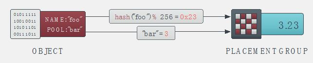
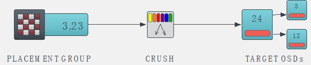
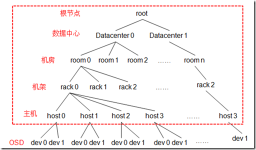
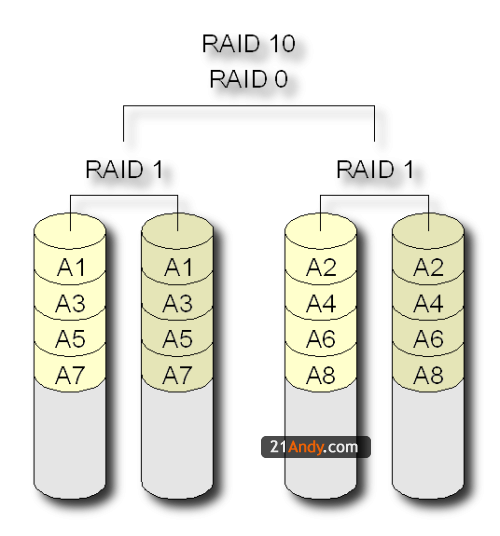
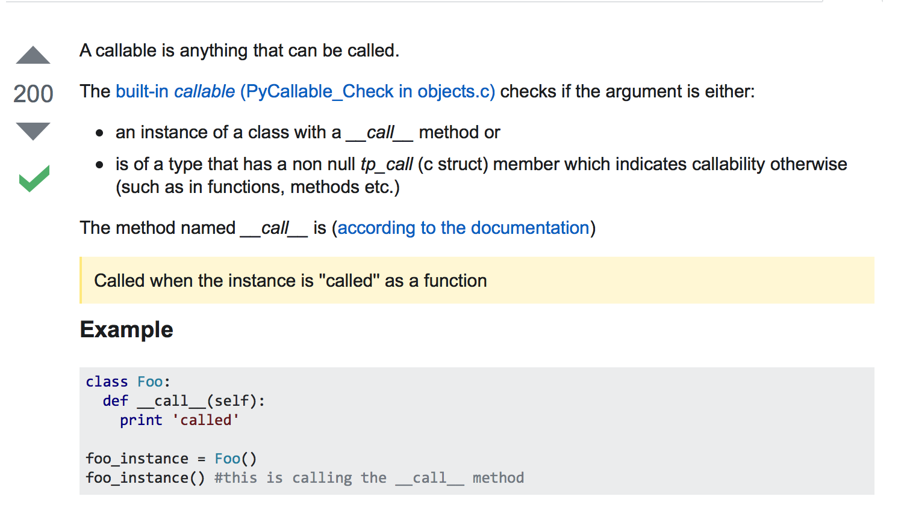

##### 2017.06.02
- ansible的使用
  - 基于ssh，不用安装客户端，只需要在操作节点安装ansible即可
  - 需要配置/etc/ansible/hosts
  - 可以通过 -m指定命令类型 -u指定执行命令用户
- ssh公钥和私钥
  - 公钥和私钥互为加密揭秘的一组钥匙
  - 公钥加密，私钥解密
  - 私钥加密（数字签名)，公钥验证
- C++ 封装,继承,多态，如何理解？
  - 封装：类的成员不直接暴露给外部，而是通过接口的形式供外部使用
  - 继承：子类不必自己定义，可以拥有父类的属性和方法
  - 多态：通过重写父类的方法，形成有特性的个体？
  - 能否举一个实际例子阐述？
    - 继承：子类小猫和小狗都继承于父类动物，都要叫的方法
    - 多态：小猫喵喵叫，小狗汪汪叫
    - 封装：小猫和小狗叫的方法实现，外部是不知道的。。。
- C++和C static有什么作用？
- WSGI是什么？
  - Web Server Gateway Interface
- REST是什么？RESTful 接口？
- Deb安装包区分ubuntu的发行版吗？14.04和16.04能安装同一个deb吗？
  - deb安装包按照cpu架构来区分，有amd64，i386等对应x86的64位和32位
  - 32位的安装包也可以安装在64位的系统上，因为可以安装32位兼容包lib32z1
  - 在32位兼容包安装之前，会一直提示文件不存在
- 如何制作ubuntu根文件系统
- Ceph的Crush算法是怎样的？
- 什么实践提高了ceph的性能？
- 纠删码是什么？
- 如何对Ceph集群内部网络延迟测试，并发测试？
  ```
  #利用ansible和iperf实现并发的网络测试
  #!/bin/bash
  # $1 = the number od server node.
  iperfClient(){
        let cNum=$1+base
        clientNode=mnv$cNum
        echo "clientNode is "$clientNode
        echo "serverIP is "$serverIP
        ansible $clientNode -m shell -a "iperf -c $serverIP -d | grep bits/sec" -u mnvadmin
  }
  s=$1
  base=40
  let ipNum=s+base
  serverIP=192.168.98.$ipNum
  for ((i=1;i<s;i++));do
    iperfClient i
  done
  let s++
  for ((i=s;i<=12;i++));do
    iperfClient i
  done
  ```
- 什么是python爬虫
- 什么是纤程？
- 进程间通信的目的
  - 数据传输
    - 一个进程需要将它的数据发送给另一个进程，发送的数据量在一个字节到几M字节之间
  - 数据共享
    - 多个进程想要操作共享数据，一个进程对共享数据
  - 通知事件
    - 一个进程需要向另一个或一组进程发送消息，通知它（它们）发生了某种事件（如进程终止时要通知父进程）。
  - 资源共享
    - 多个进程之间共享同样的资源。为了作到这一点，需要内核提供锁和同步机制。
- 进程间通信的方法
  1. 管道
  2. 信号
  3. 消息队列
  4. 共享内存
  5. 信号量
  6. socket
- 线程间同步的方法
  - 临界区
- OpenStack有哪些核心模块？
- AMPQ是什么？
- 什么是LGPL？
- 什么是分布式的？
  无中心结构，系统规模可以没有理论上限的扩展。
- 大规模分布式存储的两个基本问题，“我应该把数据写入到什么地方”和“我之前把数据写到了什么地方”
- 什么是哈希算法
- 什么是Raid
- 什么是条带化
- 什么是MD5
- 什么是SHA
- 什么是一致性HASH算法
  - 将机器和object统一映射到[0,2^32 - 1]的闭环空间里面去
  - 在移除 / 添加一个节点（机器，ip）时，它能够尽可能小的改变已存在 key 映射关系，尽可能的满足单调性的要求
  - 实现步骤
    - 将各个服务器使用Hash进行一个哈希，具体可以选择服务器的ip或主机名作为关键字进行哈希，这样每台机器就能确定其在哈希环上的位置
    - 将数据key使用相同的函数Hash计算出哈希值，并确定此数据在环上的位置，从此位置沿环顺时针“行走”，第一台遇到的服务器就是其应该定位到的服务器
    
  - 容错性
    - 现假设Node C不幸宕机，可以看到此时对象A、B、D不会受到影响，只有C对象被重定位到Node D。一般的，在一致性哈希算法中，如果一台服务器不可用，则受影响的数据仅仅是此服务器到其环空间中前一台服务器（即沿着逆时针方向行走遇到的第一台服务器）之间数据，其它不会受到影响。
  - 可扩展性
    - 一般的，在一致性哈希算法中，如果增加一台服务器，则受影响的数据仅仅是新服务器到其环空间中前一台服务器（即沿着逆时针方向行走遇到的第一台服务器）之间数据，其它数据也不会受到影响。
  - 平衡性改善
    - 一致性哈希算法引入了虚拟节点机制，即对每一个服务节点计算多个哈希，每个计算结果位置都放置一个此服务节点，称为虚拟节点。

- 什么是质数（素数）
  - 素数，又称质数，是只能被1或者自己整除的自然数。
- 什么是无人值守模式
- 将daydayup上传到github
  - https://github.com/3kboy24/mygit
  - git add #添加文件
  - git checkout撤销操作
    - git checkout -- <文件名>  #撤销对某个文件的修改
    - git checkout -- .  #撤销对所有文件的修改

##### 2017.06.03


##### 2017.06.05
- 如何理解dmesg中的硬盘错误及警告
- http和https的区别
- 什么是OSI
  - OSI模型，即开放式通信系统互联参考模型(Open System Interconnection）
  - 应用层
    - SMTP，FTP，TFTP，HTTP，NFS，telnet，dns
  - 表示层
  - 会话层
  - 传输层
    - TCP／UDP
  - 网络层
    - IP／ICMP／IGMP
    - 路由器工作
  - 数据链路层
    - arp／rarp
    - 交换机工作
  - 物理层
- 什么是TCP／IP协议
- 什么是TCP／IP三次握手？
  

  - Transmission Control Protocol/Internet Protocol的简写，中译名为传输控制协议/因特网互联协议，又名网络通讯协议，是Internet最基本的协议、Internet国际互联网络的基础，***由网络层的IP协议和传输层的TCP协议组成。*** TCP/IP 定义了电子设备如何连入因特网，以及数据如何在它们之间传输的标准。协议采用了4层的层级结构，每一层都呼叫它的下一层所提供的协议来完成自己的需求。通俗而言：TCP负责发现传输的问题，一有问题就发出信号，要求重新传输，直到所有数据安全正确地传输到目的地。而IP是给因特网的每一台联网设备规定一个地址
- python函数作为返回值
  ```
  def lazy_sum(*args):
    def sum():
      ax = 0
      for n in args:
        ax = ax + n
      return ax
  return sum
  ```
  - 在这个例子中，我们在函数lazy_sum中又定义了函数sum，并且，内部函数sum可以引用外部函数lazy_sum的参数和局部变量，当lazy_sum返回函数sum时，相关参数和变量都保存在返回的函数中，这种称为“闭包（Closure）”的程序结构拥有极大的威力。
  - 返回闭包时牢记的一点就是：返回函数不要引用任何循环变量，或者后续会发生变化的变量。
  - 什么是eventlet

##### 2017.06.06
- ceph的数据分布流程
  1. PG-id = hash(pool-id). hash(objet-id) % PG-number
    

  2. OSD-ids = CURSH(PG-id, cluster-map, cursh-rules)
    
  CRUSH的作用就是，根据pgid得到一个OSD列表
    - cluster-map
      - crush map
        - 包含当前磁盘、服务器、机架的层级结构。
      - osd map
        - 包含当前所有pool的状态和OSD的状态。OSDMap管理当前ceph中所有的OSD，OSDMap规定了crush算法的一个范围，在这个范围中选择OSD结合。OSDMap其实就是一个树形的结构，叶子节点是device（也就是osd），其他的节点称为bucket节点，这些bucket都是虚构的节点
          
    - crush-rules
      - CrushRules就是数据映射的策略，决定了每个数据对象有多少个副本，这些副本如何存储。 Crush算法是一种伪随机算法，通过权重决定数据存放（如跨机房、机架感知等），通常采用基于容量的权重。Crush算法支持副本和EC两种数据冗余方式，还提供了四种不同类型的Bucket(Uniform、List、Tree、Straw)，大多数情况下的都采用Straw。
- RAID0,RAID1,RAID5,RAID10
  - RAID0
    - RAID 0 并不是真正的RAID结构，没有数据冗余，没有数据校验的磁盘陈列。实现RAID 0至少需要两块以上的硬盘，它将两块以上的硬盘合并成一块，数据连续地分割在每块盘上。 因为带宽加倍，所以读/写速度加倍， 但RAID 0在提高性能的同时，并没有提供数据保护功能，只要任何一块硬盘损坏就会丢失所有数据。因此RAID 0 不可应用于需要数据高可用性的关键领域。
  - RAID1
    - RAID 1通过磁盘数据镜像实现数据冗余，在成对的独立磁盘上产生互 为备份的数据。当原始数据繁忙时，可直接从镜像拷贝中读取数据，因此RAID 1可以提高读取性能。RAID 1是磁盘阵列中单位成本最高的，但提供了很高的数据安全性和可用性。
  - RAID5
    - RAID 5 是一种存储性能、数据安全和存储成本兼顾的存储解决方案。 RAID 5可以理解为是RAID 0和RAID 1的折中方案。RAID 5可以为系统提供数据安全保障，但保障程度要比Mirror低而磁盘空间利用率要比Mirror高。RAID 5具有和RAID 0相近似的数据读取速度，只是多了一个奇偶校验信息，写入数据的速度比对单个磁盘进行写入操作稍慢。同时由于多个数据对应一个奇偶校验信息，RAID 5的磁盘空间利用率要比RAID 1高，存储成本相对较低，是目前运用较多的一种解决方案。
  - RAID10
    - RAID10也被称为镜象阵列条带。象RAID0一样，数据跨磁盘抽取；象RAID1一样，每个磁盘都有一个镜象磁盘, 所以RAID 10的另一种会说法是 RAID 0+1。RAID10提供100%的数据冗余，支持更大的卷尺寸，但价格也相对较高。对大多数只要求具有冗余度而不必考虑价格的应用来说，RAID10提 供最好的性能。
    

##### 2017.06.07
- 什么是HOOKS
- python的装饰
- What is a “callable” in Python?
  
- 如何理解python everything is object
  - class，function，attribute，数据类型都是对象
- python的pass关键字
  - Python pass是空语句,是为了保持程序结构的完整性。 pass 不做任何事情,一般用做占位语句
  - 为什么要有空语句
- 什么是lamda表达式
- 如何理解python paste deploy
  - paste deploy是用来配置和管理WSGI 应用的一套系统，对于WSGI应用的使用者而言，可以方便地从配置文件汇总加载WSGI应用（loadapp）；对于WSGI应用的开发人员而言，只需要给自己的应用提供一套简单的入口点即可

##### 2017.06.09  
- 叶子节点
  - 叶子结点是离散数学当中的概念。一棵树当中没有子结点（即度为0）的结点，称为叶子结点，简称“叶子”。叶子是指度为0的结点，又称为终端结点。
- IOPS
  - IOPS (Input/Output Per Second)即每秒的输入输出量(或读写次数)，是衡量磁盘性能的主要指标之一。IOPS是指单位时间内系统能处理的I/O请求数量，一般以每秒处理的I/O请求数量为单位，I/O请求通常为读或写数据操作请求
  - IOPS和数据吞吐量适用于不同的场合：
    - 读取10000个1KB文件，用时10秒  Throught(吞吐量)=1MB/s ，IOPS=1000  追求IOPS
    - 读取1个10MB文件，用时0.2秒  Throught(吞吐量)=50MB/s, IOPS=5  追求吞吐量
- 关于ceph数据寻址
  - Linux 透视图中的一个文件会分配到一个来自元数据服务器的 inode number（INO），对于文件这是一个唯一的标识符。然后文件被推入一些对象中（根据文件的大小）。使用 INO 和 object number（ONO），每个对象都分配到一个对象 ID（OID）。在 OID 上使用一个简单的哈希，每个对象都被分配到一个放置组。
  - 

- Ceph的Cache分层是什么？
  - Cache Tiering的基本思想就是冷热数据分离，用相对快速／昂贵的存储设备比如SSD，组成一个Pool来作为Cache层，后端用相对慢速／廉价的设备来组建冷数据存储池，作为Storage层或者是Base层。Cache层维护有Base层的一部分数据，Cache层需要是多副本模式，Storage层可以是多副本模式或者纠删码模式。
- 什么是ARP
  - 地址解析协议，即ARP（Address Resolution Protocol），是根据IP地址获取物理地址的一个TCP/IP协议。主机发送信息时将包含目标IP地址的ARP请求广播到网络上的所有主机，并接收返回消息，以此确定目标的物理地址；收到返回消息后将该IP地址和物理地址存入本机ARP缓存中并保留一定时间，下次请求时直接查询ARP缓存以节约资源
- NAT
  - NAT（Network Address Translation）是指在数据包传递过程中，修改IP报头中的源或者目的地址的过程。
  - SNAT
    - 源网络地址转换
    - 应用多个PC使用路由器共享上网
  - DNAT
    - 目的网络地址转换
    - Web服务器放在内网以配置内网IP，前端有个防火墙配置公网IP，互联网上的访问者使用公网IP来访问这个网站，当访问的时候客户端发送一个数据包，这个数据包的报头里面目标地址是防火墙的公网IP，防火墙就会吧这个数据包的报头修改一次，用目标地址改写Web服务器的内网IP，然后再把这个数据包发送到内网的Web服务器上。
- 如何理解网路二层设别和三层设备
- IP报文
  
- 关于linux防火墙
  - 其实iptables只是Linux防火墙的管理工具而已，位于/sbin/iptables。真正实现防火墙功能的是 netfilter，它是Linux内核中实现包过滤的内部结构。
  - iptables传输数据包的过程
    1. 当一个数据包进入网卡时，它首先进入PREROUTING链，内核根据数据包目的IP判断是否需要转送出去。
    2. 如果数据包就是进入本机的，它就会沿着图向下移动，到达INPUT链。数据包到了INPUT链后，任何进程都会收到它。本机上运行的程序可以发送数据包，这些数据包会经过OUTPUT链，然后到达POSTROUTING链输出。
    3. 如果数据包是要转发出去的，且内核允许转发，数据包就会如图所示向右移动，经过FORWARD链，然后到达POSTROUTING链输出。
    
- 什么是VLAN
- OpenStack的API路由是如何实现的？
##### 2017.06.11
- 什么是git pull和git fetch？
  

- jude图中的opt和alt什么意思？
  - alt 多选一的片段，只有条件为真者会执行
  - opt 可选的，该片段只在所给条件为真时执行，等同于只有一个片断的alt
  - **UML详细见 http://blog.sina.com.cn/s/blog_72ef7bea0100p2hz.html**
- 聚合关系
  - 关联关系的一种，是一种强关联关系；聚合关系是整体和个体/部分之间的关系；关联关系的两个类处于同一个层次上，而聚合关系的两个类处于不同的层次上，一个是整体，一个是个体/部分；在聚合关系中，代表个体/部分的对象有可能会被多个代表整体的对象所共享
- 组合关系
  - 也是关联关系的一种，但它是比聚合关系更强的关系。组合关系要求聚合关系中代表整体的对象要负责代表个体/部分的对象的整个生命周期；组合关系不能共享；在组合关系中，如果代表整体的对象被销毁或破坏，那么代表个体/部分的对象也一定会被销毁或破坏；而聚在合关系中，代表个体/部分的对象则有可能被多个代表整体的对象所共享，而不一定会随着某个代表整体的对象被销毁或破坏而被销毁或破坏。

#### 2017.06.11
- 什么是python 的tox
  - Tox is a generic virtualenv management and test command line tool you can use for
    - checking your package installs correctly with different Python versions and interpreters
    - running your tests in each of the environments, configuring your test tool of choice
    - acting as a frontend to Continuous Integration servers, greatly reducing boilerplate and merging CI and shell-based testing.
    - Tox Sample
      - http://www.sohu.com/a/120074606_487512
- python如何调用shell命令
  - os.system
    - os.system('cat /proc/cpuinfo')
    - 没有输出结果
  - os.popen()
      ```
      output = os.popen('cat /proc/cpuinfo')
      print output.read()
      ```
    - 有输出结果，但是没有返回结果
  - commands.getstatusoutput()
      ```
      (status, output) = commands.getstatusoutput('cat /proc/cpuinfo')
      print status, output
      ```
      - 可以获得到返回值和输出，非常好用
- linux创建进程的方法
- linux创建线程的方法
- python创建进程的方法
- python创建线程的方法
- 什么是mapreduce
- 什么是

- 如何升级pip和setuptools
  - python -m pip install -U pip setuptools
  - vi /opt/stack/devstack/inc/python

#### 2017.06.15
- keystone服务启动失败临时对应方法
   - ```
   #!/usr/bin/env bash
   sudo mkdir /var/run/uwsgi/
   sudo chown stack /var/run/uwsgi/
   sudo systemctl start devstack@keystone.service
   sudo systemctl start devstack@placement-api.service
    ```
- devstack环境下，openstack各模块服务所在位置
  /etc/systemd/system
- systemctl状态查看命令
  - systemctl status devstack@keystone.service
- journalctl查看日志
  - journalctl -f --unit devstack@keystone.service
  - sudo journalctl -f --unit devstack@c-vol.service

- c-vol中ERROR cinder.service [-] Manager for service cinder-volume localhost.localdomain@lvmdriver-1 is reporting problems, not sending heartbeat. Service will appear "down".的问题
  - ```
  sudo losetup -f /opt/stack/data/stack-volumes-default-backing-file
  sudo losetup -f /opt/stack/data/stack-volumes-lvmdriver-1-backing-file
  ```
#### 2017.06.15  
- 如何理解losetup
  - 用来设置循环设备的命令，让用户可以像访问块设备一样访问一个文件夹。
  - 循环设备：
    - loop device：unix系统下的伪设备，需要同一个文件进行连接。
      利用losetup命令，loop设备可以将文件虚拟成块设备。
- 什么是libvirt
- 什么是QEMU
- 什么是Xen
