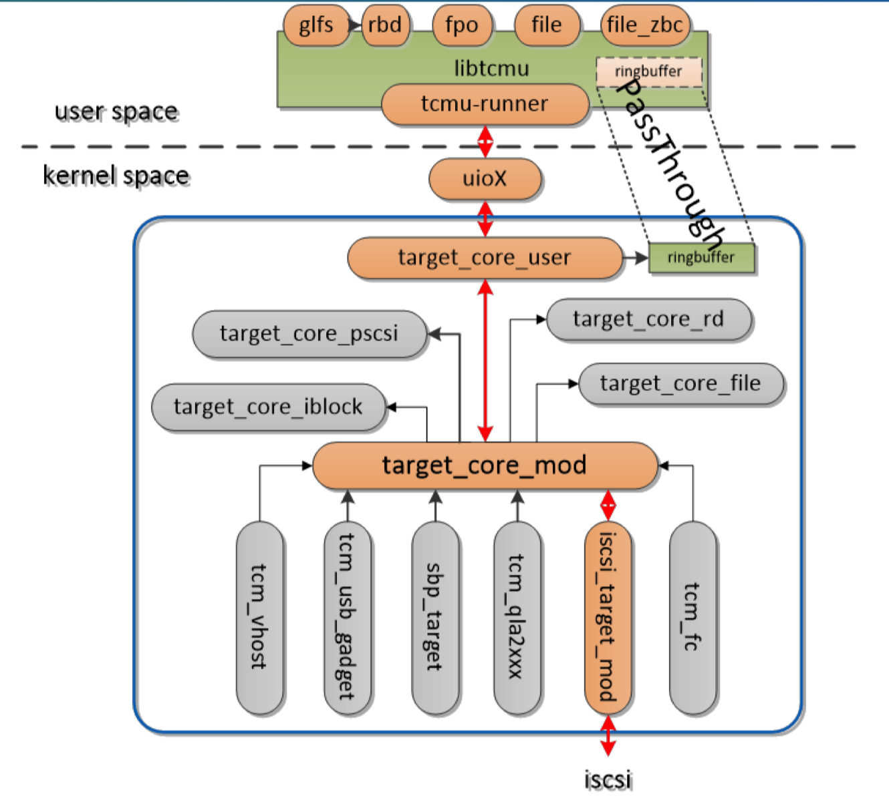

## Preparation
- Architecture
    - 
    - iSCSI initiator -> SCSI commands -> iSCSI target
    - iSCSI target -> LIO -> TCMU -> librbd -> RBD Image -> iSCSI initiator
    - iSCSI commands -> LIO core -> iscsi_target_mod -> target_core_mod -> target_core_user -> uioX -> tcmu-runner -> libtcmu -> librbd
- Pre-Requirements
    - http://docs.ceph.com/docs/master/rbd/iscsi-target-cli/
    - add all gateway host information in every gateway nodes in /etc/hosts

- epel installation
```
sudo yum install -y https://dl.fedoraproject.org/pub/epel/epel-release-latest-7.noarch.rpm
yum makecache
```

- ceph installation
```
setenforce 0
vi /etc/yum.repos.d/ceph.repo

[Ceph]
name=Ceph packages for $basearch
baseurl=http://download.ceph.com/rpm-luminous/el7/$basearch
enabled=1
gpgcheck=1
type=rpm-md
gpgkey=https://download.ceph.com/keys/release.asc

[Ceph-noarch]
name=Ceph noarch packages
baseurl=http://download.ceph.com/rpm-luminous/el7/noarch
enabled=1
gpgcheck=1
type=rpm-md
gpgkey=https://download.ceph.com/keys/release.asc

[ceph-source]
name=Ceph source packages
baseurl=http://download.ceph.com/rpm-luminous/el7/SRPMS
enabled=1
gpgcheck=1
type=rpm-md
gpgkey=https://download.ceph.com/keys/release.asc

yum install ceph
```

- Dependencies installation:
```
yum install git cmake gcc python-devel libnl3 librbd1 pyparsing pyOpenSSL python-gobject kmod-devel iptables-services python-pip
pip install pip --upgrade
pip install kmod pyudev urwid pyparsing rados rbd netaddr netifaces crypto requests flask pycrypto
```

- tcmu-runner:
```
git clone https://github.com/open-iscsi/tcmu-runner
cd tcmu-runner
./extra/install_dep.sh
cmake -Dwith-glfs=true -Dwith-qcow=false -DSUPPORT_SYSTEMD=ON -DCMAKE_INSTALL_PREFIX=/usr
make install
systemctl daemon-reload
systemctl enable tcmu-runner
systemctl start tcmu-runner
```

- rtslib-fb:
```
git clone https://github.com/open-iscsi/rtslib-fb.git
cd rtslib-fb
python setup.py install
```

- configshell-fb:
```
git clone https://github.com/open-iscsi/configshell-fb.git
cd configshell-fb
python setup.py install
```

- targetcli-fb:
```
git clone https://github.com/open-iscsi/targetcli-fb.git
cd targetcli-fb
python setup.py install
mkdir /etc/target
mkdir /var/target
```

- ceph-iscsi-config:
```
git clone https://github.com/ceph/ceph-iscsi-config.git
cd ceph-iscsi-config
python setup.py install --install-scripts=/usr/bin
cp usr/lib/systemd/system/rbd-target-gw.service /lib/systemd/system
systemctl daemon-reload
systemctl enable rbd-target-gw
systemctl start rbd-target-gw
```

- ceph-iscsi-cli:
```
git clone https://github.com/ceph/ceph-iscsi-cli.git
cd ceph-iscsi-cli
python setup.py install
cp usr/lib/systemd/system/rbd-target-api.service /lib/systemd/system
```

- vi /etc/ceph/iscsi-gateway.cfg
```
[config]
# Name of the Ceph storage cluster. A suitable Ceph configuration file allowing
# access to the Ceph storage cluster from the gateway node is required, if not
# colocated on an OSD node.
cluster_name = ceph

# Place a copy of the ceph cluster's admin keyring in the gateway's /etc/ceph
# drectory and reference the filename here
gateway_keyring = ceph.client.admin.keyring


# API settings.
# The API supports a number of options that allow you to tailor it to your
# local environment. If you want to run the API under https, you will need to
# create cert/key files that are compatible for each iSCSI gateway node, that is
# not locked to a specific node. SSL cert and key files *must* be called
# 'iscsi-gateway.crt' and 'iscsi-gateway.key' and placed in the '/etc/ceph/' directory
# on *each* gateway node. With the SSL files in place, you can use 'api_secure = true'
# to switch to https mode.

# To support the API, the bear minimum settings are:
api_secure = false

# Additional API configuration options are as follows, defaults shown.
# api_user = admin
# api_password = admin
# api_port = 5001
# change to your own IPs
trusted_ip_list = 10.0.1.201,10.0.1.203
```
## Build Target
```
scp ceph.conf,iscsi-gateway.cfg,ceph.client.admin.keyring in /etc/ceph/ from the first gateway to other gateways
cd iscsi-target
create iqn.2003-01.com.redhat.iscsi-gw:iscsi-igw
cd iqn.2003-01.com.redhat.iscsi-gw:iscsi-igw/gateways
create tcmu-gw1 10.0.1.111 skipchecks=true
create tcmu-gw2 10.0.1.112 skipchecks=true
cd /disks
create pool=rbd image=disk_1 size=200G
cd /iscsi-target/iqn.2003-01.com.redhat.iscsi-gw:iscsi-igw/hosts
create iqn.1994-05.com.redhat:rh7-client
auth chap=myiscsiusername/myiscsipassword
disk add rbd.disk_1
create pool=rbd_pool image=disk_2 size=1000G
```

- targetcli add disk:
```
cd /backstores/user:rbd
create name=my_ec_test size=50T cfgstring=rbd_pool/image2,max_data_area_mb=256 hw_max_sectors=8192 
cd /iscsi/iqn.2003-01.com.redhat.iscsi-gw:iscsi-igw/tpg1/luns
create /backstores/user:rbd/my_ec_test
```

- targetcli remove disk:
```
targetcli remove disk:
cd /backstores/user:rbd
delete my_ec_test
```

- gwcli add disk:
```
cd /disks
create pool=rbd_pool image=image2 size=50T max_data_area_mb=1024
cd /iscsi-target/iqn.2003-01.com.redhat.iscsi-gw:iscsi-igw/hosts/iqn.1994-05.com.redhat:rh7-client/
disk add rbd_pool.image2
```

- gwcli remove disk:
```
cd /iscsi-target/iqn.2003-01.com.redhat.iscsi-gw:iscsi-igw/hosts/iqn.1994-05.com.redhat:rh7-client
disk remove rbd_pool.disk_2
cd /disks
delete rbd_pool.disk_2
```
- gwcli reconfigure:
```
reconfigure image_id=rbd.disk_1 attribute=max_data_area_mb value=128
```

## Build Initiator
```
yum install iscsi-initiator-utils
yum install device-mapper-multipath
mpathconf --enable --with_multipathd y

vi /etc/iscsi/initiatorname.iscsi
InitiatorName=iqn.1994-05.com.redhat:rh7-client

vi /etc/iscsi/iscsid.conf 
node.session.auth.authmethod = CHAP
node.session.auth.username = myiscsiusername
node.session.auth.password = myiscsipassword

iscsiadm --mode node --logout 
systemctl restart iscsid
iscsiadm -m discovery -t sendtargets -p 10.0.1.111
iscsiadm -m node -T iqn.2003-01.com.redhat.iscsi-gw:iscsi-igw -l
```

## TroubleShooting 
- Trouble:
    - when excute gwcli, shell show "IndexError: list index out of range"
- Solution:
    ```
    yum install ceph 
    ```
- Trouble:
    - when excute gwcli, shell show "ImportError: No module named 'requests.packages.urllib3'"
- Solution:
    ```
    pip uninstall urllib3
    pip install --upgrade urllib3
    ```
- Trouble:
    - Unable to access the configuration object : REST API failure, code : 500 GatewayError: 
- Solution:
    ```
    create pool named rbd 
    systemctl daemon-reload
    systemctl enable rbd-target-api
    systemctl start rbd-target-api
    systemctl enable rbd-target-gw
    systemctl start rbd-target-gw
    ```
- Trouble:
    - When we try to add second gateway, gwcli show " Gateway creation failed, gateway(s) unavailable:10.0.2.201(UNKNOWN state)"
- Solution: 
    - read https://github.com/ceph/ceph-iscsi-cli/issues/59
    - vi /etc/ceph/iscsi-gateway.cfg and add
    ``` 
    trusted_ip_list =10.0.1.201,10.0.1.203
    ```
    - vi /etc/hosts add
    ```
    10.0.1.201 vm-tcmu
    10.0.1.203 vm-tcmu2
    ```
    - stop firewallld, iptables
    ```
    systemctl stop firewalld.service
    systemctl stop iptables 
    ```
- Trouble:
    - iscsiadm -m discovery -t -st 10.0.1.201 can not Discover the target portals, and systemctl status iscsi.service returned "start condition failed at xxx,none of the trigger conditions were met"
- Solution
    ```
    Do not edit /etc/iscsi/iscsid.conf for CHAP, keep it No CHAP as default
    systemctl enable iscsid iscsi
    systemctl start iscsid iscsi
    ```
- Trouble:
    - when we execute "iscsiadm -m node -T iqn.2003-01.com.redhat.iscsi-gw:iscsi-igw -l" to login node it returns "initiator reported error (24 - iSCSI login failed due to authorization failure)"
- Solution
    ```
    refer to https://github.com/ceph/ceph-iscsi-cli/issues/13
    vi /etc/iscsi/initiatorname.iscsi
    InitiatorName=iqn.1994-05.com.redhat:rh7-client

    vi /etc/iscsi/iscsid.conf 
    node.session.auth.authmethod = CHAP
    node.session.auth.username = myiscsiusername
    node.session.auth.password = myiscsipassword

    systemctl restart iscsid iscsi
    ```    
- Trouble:
    - poor performance
- Solution:
    - ensure max_data_area_mb >= 128 &&  hw_max_sectors>=4096
    - set hw_max_sectors in gwcli 
        - we should add code in ceph-iscsi-config/ceph_iscsi_config/lun.py 
        ```
        def add_dev_to_lio(self, in_wwn=None):
        """
        Add an rbd device to the LIO configuration
        :param in_wwn: optional wwn identifying the rbd image to clients
        (must match across gateways)
        :return: LIO LUN object
        """
        self.logger.info("(LUN.add_dev_to_lio) Adding image "
                         "'{}' to LIO".format(self.config_key))

        # extract control parameter overrides (if any) or use default
        controls = self.controls.copy()
        for k in ['max_data_area_mb']:
            if controls.get(k, None) is None:
                controls[k] = getattr(settings.config, k, None)

        control_string = gen_control_string(controls) 
        control_string += ",hw_max_sectors=8192 #add code 
        print "zhd-debug control string is %s." % control_string #add code
        ...
        ...
        ...
        ```
- Trouble:
    - tcmu_reset_netlink:146: Kernel does not support reseting netlink
    - tcmu_block_device:387 rbd/rbd.disk_4: Kernel does not support the block_dev action.
    - tcmu_rbd_check_excl_lock_enabled:757 rbd/rbd.disk_4: HA not supported.
    - tcmu_unblock_netlink:114: Kernel does not support unblocking netlink
- Solution:
    - none
- Trouble:
    - targetcli show "Could not create NetworkPortal in configFS"
- Solution:
    - delete 0.0.0.0 3260 in targetcli
- Trouble:
    - Failed to start Ceph iscsi target configuration API.
- Solution:
    - reboot PC
- Trouble:
    - iscsiadm: Could not logout of [sid: 111, target: iqn.2018-09.com.test:target1, portal: 10.0.1.111,3260]
- Solution:
    - iscsiadm -m node -T iqn.2018-09.com.test:target1 -p 10.0.1.111 --logout
    - iscsiadm -m node -T iqn.2018-09.com.test:target1 -p 10.0.1.111 -o delete
    - iscsiadm -m node --op delete --targetname iqn.2018-09.com.test:target1 
- Trouble:
    - Failed : disk create/update failed on tcmu-gw1. LUN allocation failure
    - Only image features RBD_FEATURE_LAYERING,RBD_FEATURE_EXCLUSIVE_LOCK,RBD_FEATURE_OBJECT_MAP,RBD_FEATURE_FAST_DIFF,RBD_FEATURE_DEEP_FLATTEN are supported
- Solution:
    - rbd -p rbd_pool feature enable image2 layering exclusive-lock object-map fast-diff {deep-flatten}
- Trouble: 
    - gwcli delete rbd_pool.imagex too slow
- Solution:
    - remove disk in gateway
    ```
    rados -p rbd get gateway.conf - > gateway.conf
    delete disk section manually
    rados -p rbd put gateway.conf gateway.conf
    ```
    - disk section example
    ```
        "disks": {
        "rbd_pool.image2": {
            "controls": {
                "max_data_area_mb": "1024"
            },
            "created": "2018/09/12 07:36:08",
            "image": "image2",
            "owner": "tcmu-gw1",
            "pool": "rbd_pool",
            "pool_id": 4,
            "updated": "2018/09/12 07:36:08",
            "wwn": "6a36e98c-7818-4681-9fde-be4866a74795"
        }
    ```
## Useful commands
- clear gateways
```
rados -p rbd get gateway.conf -
rados -p rbd put gateway.conf gateway.conf
    {
    "clients": {},
    "created": "2018/08/24 03:06:39",
    "disks": {},
    "epoch": 0,
    "gateways": {},
    "groups": {},
    "updated": "",
    "version": 3
    }
```

- service start
```
systemctl daemon-reload
systemctl enable tcmu-runner
systemctl start tcmu-runner
systemctl daemon-reload
systemctl enable rbd-target-gw
systemctl start rbd-target-gw
systemctl daemon-reload
systemctl enable rbd-target-api
systemctl start rbd-target-api
```

- service restart
```
systemctl daemon-reload
systemctl restart tcmu-runner
systemctl restart rbd-target-api
systemctl restart rbd-target-gw
systemctl status tcmu-runner
systemctl status rbd-target-api
systemctl status rbd-target-gw
```

- service status
```
systemctl status tcmu-runner
systemctl status rbd-target-api
systemctl status rbd-target-gw
```
- curl exmaple:
```
curl --insecure --user admin:admin -X GET http://10.0.1.111:5000/api/gateways
curl --insecure --user admin:admin -d "ip_address=10.0.1.203" \
-X PUT https://10.0.1.201/api/gateway/vm-tcmu2
```

- systemctl commands
```
systemctl list-unit-files
systemctl list-dependencies iscsi.service
```

- scp example:
```
scp root@vm-tcmu:/etc/ceph/iscsi-gateway.cfg .
scp iscsi-gateway.cfg root@vm-tcmu2:/etc/ceph/
```

- iscsiadm
```
show node info:
iscsiadm -m node -T iqn.2003-01.com.redhat.iscsi-gw:iscsi-igw
remove targets:
rm -rf /var/lib/iscsi/send_targets/10.0.1.201,3260/
cat /sys/kernel/config/target/iscsi/iqn.2003-01.com.redhat.iscsi-gw:iscsi-igw/tpgt_1/attrib/default_cmdsn_depth
iscsiadm --mode node --logout 
iscsiadm -m session -P3 

```
- others
```
systemctl stop firewalld.service
systemctl stop iptables 

rbd map rbd_pool/image2
targetcli /backstores/block create name=rbd_iblock1 dev=/dev/rbd/rbd_pool/image2
targetcli /iscsi/iqn.2018-09.com.test:target1/tpg1/luns create /backstores/block/rbd_iblock1
targetcli /iscsi/iqn.2018-09.com.test:target1/tpg1/luns create

targetcli /iscsi create iqn.2018-09.com.test:target1
cd /backstores/user:rbd
create name=my_replicated_test size=1000G cfgstring=rbd_pool/replicated_image1 hw_max_sectors=8192
cd /iscsi/iqn.2018-09.com.test:target1/tpg1/luns
create /backstores/user:rbd/my_replicated_test
targetcli /iscsi/iqn.2018-09.com.test:target1/tpg1/portals create 10.0.1.111
targetcli /iscsi/iqn.2018-09.com.test:target1/tpg1 set auth userid=mnctarget password=target1
targetcli /iscsi/iqn.2018-09.com.test:target1/tpg1 set attribute authentication=1 demo_mode_write_protect=0 generate_node_acls=1
```

- Install Centos kernel sourcecode
```
As root account:
useradd user
passwd user
su user

As normal user account:
mkdir -p ~/rpmbuild/{BUILD,BUILDROOT,RPMS,SOURCES,SPECS,SRPMS}
echo '%_topdir %(echo $HOME)/rpmbuild' > ~/.rpmmacros

As root account:
yum install asciidoc audit-libs-devel bash bc binutils binutils-devel bison diffutils elfutils
yum install elfutils-devel findutils flex gawk gcc gettext gzip hmaccalc hostname java-devel
yum install m4 make module-init-tools ncurses-devel net-tools newt-devel numactl-devel openssl
yum install patch pciutils-devel perl perl-ExtUtils-Embed pesign python-devel redhat-rpm-config
yum install rpm-build sh-utils tar xmlto xz zlib-devel

As normal user account:
su user
rpm -i http://vault.centos.org/7.5.1804/os/Source/SPackages/kernel-3.10.0-862.el7.src.rpm 2>&1 | grep -v exist
cd ~/rpmbuild/SPECS
rpmbuild -bp --target=$(uname -m) kernel.spec

Sourcecode location:
/home/user/rpmbuild/BUILD/kernel-3.10.0-862.el7/linux-3.10.0-862.el7.centos.x86_64

Another methods：
https://ieevee.com/tech/2018/03/30/centos-kernel.html

```
