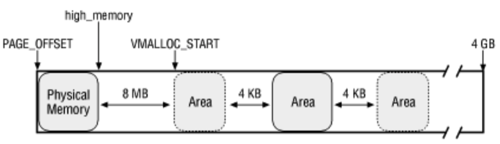
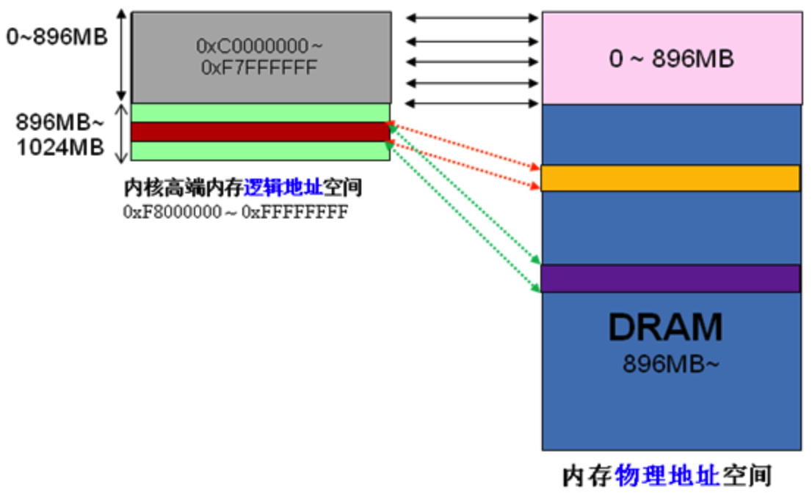
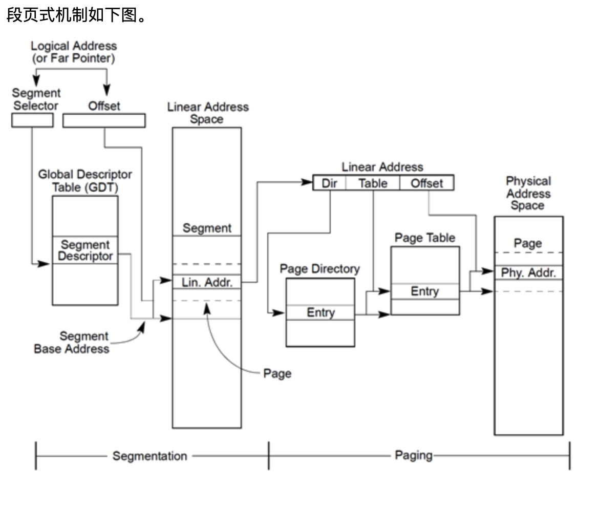
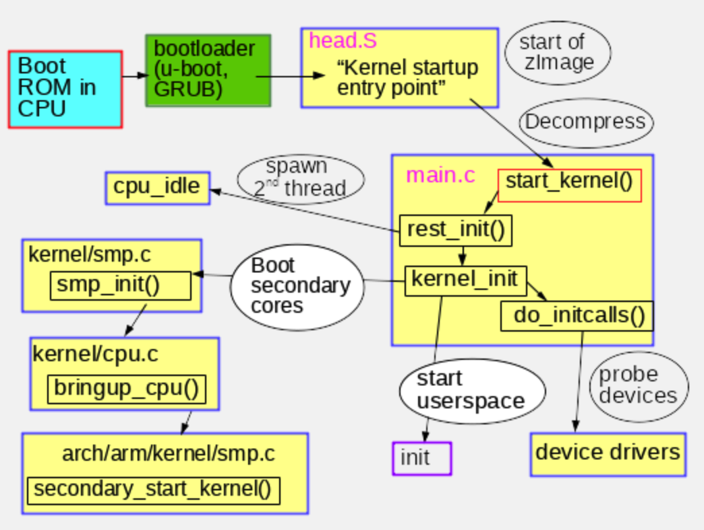

- 软中断和硬中断
	- https://www.jianshu.com/p/52a3ee40ea30
- 逻辑地址，线性地址，物理地址
	- 分段机制启用，分页机制未启用：逻辑地址->线性地址=物理地址
	- 分段，分页机制同时启用：逻辑地址->线性地址->物理地址
- 进程
	- 进程是一个容器，其中包含当执行一个程序实例时所用到的各种资源。
- 程序
	- 一个静态的指令序列
- 上下文
	- 程序（进程/中断）运行时所需要的寄存器最小的集合。
	- 通用寄存器组
		- EAX 累加器(accumulator)
		- EBX 基地址(base)寄存器
		- ECX 计数器(counter)
		- EDX 总是被用来放整数除法产生的余数
		- ESI 源变址寄存器 因为在很多字符串操作指令中, DS:ESI指向源串,而ES:EDI指向目标串.
		- EDI 目的变址寄存器
		- ESP 栈指针 专门用作堆栈指针，被形象地称为栈顶指针，堆栈的顶部是地址小的区域，压入堆栈的数据越多，ESP也就越来越小。在32位平台上，ESP每次减少4字节。
		- EBP Stack base pointer for holding the address of the current stack frame.
			- 扩展基址指针寄存器(extended base pointer) 其内存放一个指针，该指针指向系统栈最上面一个栈帧的底部。
			- C语言中，每个栈帧对应着一个未运行完的函数。栈帧中保存了该函数的返回地址和局部变量。
		
	- 段相关寄存器组
	- 标志寄存器
	- 程序指针寄存器 
		- EIP Instruction pointer. Holds the program counter, the address of next instruction.
	- GDT基地址
	- LDT段选择符
	- IDT基地址
	- 控制寄存器组
	- 浮点相关寄存器组
	- 一些特殊用途的寄存器
- select
	- select() and pselect() allow a program to monitor multiple file
       descriptors, waiting until one or more of the file descriptors become
       "ready" for some class of I/O operation (e.g., input possible).  A
       file descriptor is considered ready if it is possible to perform a
       corresponding I/O operation (e.g., read(2) without blocking, or a
       sufficiently small write(2)).
- poll
	- poll() performs a similar task to select(2): it waits for one of a
       set of file descriptors to become ready to perform I/O.
- epoll
	- The epoll API performs a similar task to poll(2): monitoring multiple
       file descriptors to see if I/O is possible on any of them.  The epoll
       API can be used either as an edge-triggered or a level-triggered
       interface and scales well to large numbers of watched file
       descriptors. 
- 镜像文件相当于磁盘
- 什么是linux交换分区
- vmlinux
- initrbd
- 一个虚拟机，对应一个qemu进程
- qemu模拟设备
- qemu source download
- qemu 调内核
- pgrep -lfa process name
- 虚拟机启动
	- qemu-system-x86_64 -name debian -vnc 10.211.55.6:0 -m 1024 -drive format=raw,index=2,file=debian.img -enable-kvm -S -s
	- qemu-system-x86_64 -name debian -nographic -m 1024 -drive format=raw,index=2,file=debian.img -enable-kvm 
	- vncview启动后输入10.211.55.6，用户名root，密码2
- 串口连接虚拟机
	- https://wiki.libvirt.org/page/Unable_to_connect_to_console_of_a_running_domain
	- https://stackoverflow.com/questions/11845280/virsh-console-hangs-at-the-escape-character/11845751
- error: internal error: unable to execute QEMU command 'device_add': Bus 'pci.0' does not support hotplugging
	- 
- 虚拟机联网（guest os中执行）
	```
	dhclient enp0s3
	ip a s enp0s3
	```
- apt-get completion
	- https://askubuntu.com/questions/86375/apt-get-autocomplete-package-name-is-broken
- debian 源
	- https://mirrors.ustc.edu.cn/help/debian.html
- /hw/arm/versatilepd.c下加uart设备，参照omap
-  qemu-system-x86_64 -kernel /home/mac/projects/kvm/linux-4.6.2/arch/x86/boot/bzImage -initrd /home/mac/projects/kvm/busybox/busybox-1.29.3/initramfs.img -smp 2 -S -s -nographic -append "console=ttyS0" -m 1024
- kvm启动
 - /usr/bin/qemu-system-x86_64 -name guest=kvm1,debug-threads=on -S -machine pc-i440fx-trusty,accel=kvm,usb=off,dump-guest-core=off -m 1024 -realtime mlock=off -smp 1,sockets=1,cores=1,threads=1 -uuid 917cf5a3-68a2-4263-8ce8-b912fc3b5b48 -no-user-config -nodefaults -chardev socket,id=charmonitor,path=/var/lib/libvirt/qemu/domain-7-kvm1/monitor.sock,server,nowait -mon chardev=charmonitor,id=monitor,mode=control -rtc base=utc -no-shutdown -no-acpi -boot strict=on -device piix3-usb-uhci,id=usb,bus=pci.0,addr=0x1.0x2 -drive file=/home/mac/projects/kvm/debian.img,format=raw,if=none,id=drive-ide0-0-0 -device ide-hd,bus=ide.0,unit=0,drive=drive-ide0-0-0,id=ide0-0-0,bootindex=1 -netdev tap,fd=27,id=hostnet0 -device rtl8139,netdev=hostnet0,id=net0,mac=52:54:00:5f:c6:00,bus=pci.0,addr=0x3 -chardev pty,id=charserial0 -device isa-serial,chardev=charserial0,id=serial0 -vnc 10.211.55.6:0 -device cirrus-vga,id=video0,bus=pci.0,addr=0x2 -device virtio-balloon-pci,id=balloon0,bus=pci.0,addr=0x4 -msg timestamp=on
 - x86 kernel debug 
	```
	qemu-system-x86_64 -kernel /home/mac/projects/kvm/linux-4.6.2/arch/x86/boot/bzImage -initrd /home/mac/projects/kvm/busybox/busybox-1.29.3/initramfs.img -smp 2 -S -s -nographic -append "console=ttyS0" -m 1024 -net nic,model=virtio,macaddr=00:16:3e:22:22:22 -net tap
	
	qemu-system-x86_64 -kernel /home/mac/projects/kvm/linux-4.6.2/arch/x86/boot/bzImage -initrd /home/mac/projects/kvm/busybox/busybox-1.29.3/initramfs.img -smp 2 -nographic -append "console=ttyS0" -m 1024 -net nic,model=e1000

	qemu-system-x86_64 -kernel /home/mac/projects/montage/Montage.git/cicada-kernel-src/arch/x86/boot/bzImage -initrd /home/mac/projects/kvm/busybox/busybox-1.29.3/initramfs.img -smp 2 -nographic -append "console=ttyS0" -m 1024 -net nic,model=e1000 -S -s

	gdb /home/mac/projects/kvm/linux-4.6.2/vmlinux
	target remote:1234 
	b start_kernel
	b virtnet_probe
	c
	```
- qemu-arm debug
	```
	qemu-system-arm -M versatilepb -nographic -kernel /home/mac/projects/kvm/linux-4.6.2/arch/arm/boot/zImage -dtb /home/mac/projects/kvm/linux-4.6.2/arch/arm/boot/dts/versatile-pb.dtb -initrd /home/mac/projects/kvm/busybox/busybox-1.29.3/initramfs.img -append "console=ttyAMA0 root=/dev/ram rdinit=/sbin/init" -S -s

	gdb-multiarch /home/mac/projects/kvm/linux-4.6.2/vmlinux
	set architecture arm
	target remote localhost:1234
	b start_kernel 
	b lkmc_irq_handler
	c
	```
- x86 qemu debug 
	```
	 ./configure --target-list=i386-softmmu,x86_64-softmmu --enable-debug --enable-debug-stack-usage
	 make install 
	sudo gdb --args qemu-system-x86_64 -name debian -vnc 10.211.55.6:0 -m 1024 -drive format=raw,index=2,file=debian.img -enable-kvm -S -s -net nic,model=virtio,macaddr=00:16:3e:22:22:22 -net tap
	```
- LanQi qemu debug
	```
	./configure --target-list=x86_64-softmmu --enable-kvm --disable-gtk --
	enable-sdl --disable-tools --disable-docs --enable-debug
   	make -j8
   	make install

	gdbserver :1234 /home/u/Projects/cicada-qemu-src/x86_64-softmmu/qemu-system-x86_64 -smp 2 -M q35 --enable-kvm -hda /home.2/env/centos7.qcow2 -drive if=pflash,format=raw,readonly,file=/usr/share/ovmf/OVMF_CODE.fd -drive if=pflash,format=raw,file=/usr/share/ovmf/OVMF_VARS.fd -net nic -net tap,ifname=tap1,script=/home.2/env/qemu-ifup,downscript=no -m 384 -no-host-reboot -monitor stdio

	gdb /home/u/Projects/cicada-qemu-src/x86_64-softmmu/qemu-system-x86_64 
	target remote:1234
	```
- busy box build 
  ```
  make ARCH=arm CROSS_COMPILE=arm-linux-gnueabi- defconfig
  make ARCH=arm CROSS_COMPILE=arm-linux-gnueabi- menuconfig
  make ARCH=arm CROSS_COMPILE=arm-linux-gnueabi- install
  ```
- linux kernel build 
  ```
   make ARCH=arm versatile_defconfig
   make ARCH=arm CROSS_COMPILE=arm-linux-gnueabi- menuconfig
   make ARCH=arm CROSS_COMPILE=arm-linux-gnueabi- all -j4 
   make x86_64_defconfig //适用于x86默认的虚拟机
  ```
- qemu build
	```
	./configure --target-list=arm-softmmu
	```
- qemu show
  ```
	qemu-system-arm -M versatilepb -kernel /home/mac/projects/kvm/linux-4.6.2/arch/arm/boot/zImage -dtb /home/mac/projects/kvm/linux-4.6.2/arch/arm/boot/dts/versatile-pb.dtb -initrd /home/mac/projects/kvm/busybox/busybox-1.29.3/initramfs.img -append "console=ttyAMA0 root=/dev/ram rdinit=/sbin/init" -monitor stdio
	```
- normal start
 ```
 qemu-system-arm -M versatilepb -nographic -kernel /home/mac/projects/kvm/linux-4.6.2/arch/arm/boot/zImage -dtb /home/mac/projects/kvm/linux-4.6.2/arch/arm/boot/dts/versatile-pb.dtb -initrd /home/mac/projects/kvm/busybox/busybox-1.29.3/initramfs.img -append "console=ttyAMA0 root=/dev/ram rdinit=/sbin/init"
 qemu-system-arm -M versatilepb -nographic -kernel ./zImage -dtb ./versatile-pb.dtb -initrd ./initramfs.img -append "console=ttyAMA0 root=/dev/ram rdinit=/sbin/init"
 ```
- Error: unrecognized/unsupported machine ID (r1 = 0x00000183).
	- -dtb /home/mac/projects/kvm/linux-4.6.2/arch/arm/boot/dts/versatile-pb.dtb
- edu.c
	- https://lists.gnu.org/archive/html/qemu-devel/2014-10/msg01316.html
	- https://stackoverflow.com/questions/28315265/how-to-add-a-new-device-in-qemu-source-code
- yum undo
	```
	 yum history list softname
	 yum history undo Id
	```
- vmcs，vmcb

- 全模拟
	- 模拟设备：完全由 QEMU 纯软件模拟的设备
- virtio
	- Virtio 设备：实现 VIRTIO API 的半虚拟化设备
- VT-d
	- PCI 设备直接分配 （PCI device assignment） 
- IO thraed
	- https://github.com/qemu/qemu/blob/master/docs/devel/multiple-iothreads.txt
	- IOThreads allow the user to control the placement of work.  The main loop is a scalability  bottleneck on hosts with many CPUs.  Work can be spread across several IOThreads instead of just one main loop.  When set up correctly this can improve I/O latency and reduce jitter seen by the guest.
	- The default event loop is called the main loop (see main-loop.c).  It is possible to create additional event loop threads using -object iothread,id=my-iothread.
	- io thread boot
	```
    	main in vl.c
    	->module_call_init(MODULE_INIT_QOM) in vl.c
    	-->iothread_register_types
    	--->iothread_class_init
    
    	->monitor_init_globals in vl.c
    	-->monitor_iothread_init
    	--->iothread_create
    	---->object_new_with_props
    	----->object_new_with_propv
    	------>user_creatable_complete
    	------->iothread_complete
    	-------->aio_context_new
    	-------->qemu_thread_create
    	--------->pthread_create
    
    	qemu_thread_start
    	->start_routine
    	-->iothread_run
    	--->aio_poll
    
    	main
    	select_machine
    	find_default_machine
    	object_class_get_list
    	object_class_foreach
    	g_hash_table_foreach
    	char_serial_class_init
	```
	- glib
		- https://developer.gnome.org/glib/2.26/glib-The-Main-Event-Loop.html
- virtio
	- virtio 是半虚拟化 hypervisor 中位于设备之上的抽象层
	- virtio 是对半虚拟化 hypervisor 中的一组通用模拟设备的抽象
	- virtio 并没有提供多种设备模拟机制（针对网络、块和其他驱动程序），而是为这些设备模拟提供一个通用的前端，从而标准化接口和增加代码的跨平台重用。
	- 来宾操作系统知道它运行在 hypervisor 之上，并包含了充当前端的驱动程序。
	- Hypervisor 为特定的设备模拟实现后端驱动程序
	- vq virtqueue
		- 每个设备拥有多个 virtqueue 用于大块数据的传输。virtqueue 是一个简单的队列，guest 把 buffers 插入其中，每个 buffer 都是一个分散-聚集数组。
		- virtqueue_kick
			- Guest 通知 host 单个或者多个 buffer 已经添加到 queue 中,调用 virtqueue_notify()，notify 函数会向 queue notify(VIRTIO_PCI_QUEUE_NOTIFY)寄存器写入 queue index 来通知 host。
			- 最终调用virtqueue_kick 来通知qemu(及所谓的后端)，当qemu处理完后又调用virtio_mq_ops的virtblk_request_done函数。这样就完成了guest->qemu->host kernel ->hw 一个循环.
	- vring
		- virtio_ring 是 virtio 传输机制的实现，vring 引入 ring buffers 来作为我们数据传输的载体。
		- available ring 用于 guest 端表示那些描述符链当前是可用的。
		- used ring 用于Host 端表示那些描述符已经使用。
	- 流程
		- guest 端设备初始化(blk)
			- guest 前端驱动 , like /drivers/block/virtio_blk.c
				- init 函数，alloc_workqueue 申请workqueue
				- register_blkdev 注册virtio blk 设备
				- register_virtio_driver 注册到virtio bus上
				- virtblk_probe 函数分配一个struct virtio_blk *vblk;这个代表一个virtio的blk设备
				- init_vq 函数申请一个struct virtqueue **vqs;
				- vblk->disk = alloc_disk(1 << PART_BITS); 申请一个gendisk，这里代表的是virtio blk的物理硬盘
				- 分配blk 用的queue q = vblk->disk->queue = blk_mq_init_queue(&vblk->tag_set); 其中对request的操作函数是通过virtio_mq_ops
					- virtio blk的queue_rq 函数是virtio_queue_rq
		- guest 端设备初始化(net)
			- guest 前端驱动 /drivers/net/virtio_net.c
				- register_virtio_driver 注册到virtio bus上
				- alloc_etherdev_mq分配virtio的blk设备
				- dev->netdev_ops = &virtnet_netdev;负责网卡的操作，
				- init_vqs，Allocate/initialize the rx/tx queues, and invoke find_vqs
				- register_netdev注册设备
				- virtio_device_ready
				```
    				virtio_net_driver_init
    				-->register_virtio_driver
    				--->driver_register
    				---->bus_add_driver
    				----->driver_attach
    				------>bus_for_each_dev
    				------->__driver_attach
    				-------->really_probe
    				--------->virtio_dev_probe
    				---------->virtnet_probe
    
    				virtnet_probe
    				->alloc_etherdev_mq
    				->dev->netdev_ops = &virtnet_netdev;
    				->init_vqs
    				-->virtnet_alloc_queues
    				-->virtnet_find_vqs
    				->register_netdev
				```
		- 使用
			- For virtio net, the driver adds outgoing (read-only) packets to the transmit virtqueue, and then frees them after they are used. Similarly, incoming (write-only) bu􏰃ers are added to the receive virtqueue, and processed after they are used
			- virtio blk的queue_rq 函数是virtio_queue_rq，该函数最终调用virtqueue_kick来通知qemu
			```
			//网卡数据发送，通知后端的qemu
    			start_xmit 
    			->xmit_skb
    			-->virtqueue_add_outbuf 
    			--->virtqueue_add
    			---->vq->avail_idx_shadow++;
    			---->vq->vring.avail->idx = cpu_to_virtio16(_vq->vdev, vq->avail_idx_shadow); //相当于提供buf给device
    			->virtqueue_kick_prepare
    			->virtqueue_notify
    			-->vq->notify(_vq) //这个notify 从哪里赋值的没有理清
    
    			//notify赋值
    			virtio_pci_probe  
    			->virtio_pci_modern_probe
    			-->setup_vq (或者是mmio的vm_setup_v)
    			--->vring_create_virtqueue
    			---->__vring_new_virtqueue
    			----->q->notify = notify;
			```

		- qemu 后端
			- qemu 后端模拟设备处理逻辑，当qemu处理完后又调用virtio_mq_ops的virtblk_request_done函数
			- 创建网卡设备
			```
			virtio_register_types
			->virtio_net_class_init
			-->virtio_net_device_realize
			--->qemu_new_nic
			```

			- 数据接收
			```
			virtio_net_receive
			->virtio_net_receive_rcu
			-->virtqueue_pop 
			-->virtqueue_fill
			-->virtqueue_flush
			-->virtio_notify
			--->virtio_irq
			---->virtio_notify_vector
			-----> k->notify(qbus->parent, vector); //k为VirtioBusClass*
			```
		- Guest 前端
			```
			vp_modern_find_vqs
			vp_find_vqs
			vp_find_vqs_msix
			vp_request_msix_vectors
			request_irq
			request_threaded_irq


			//中断处理
			vp_vring_interrupt
			->vring_interrupt
			-->vq->vq.callback(&vq->vq)
			
			```
- 为什么经过kvm
- 都基于pci
- vfio 
- 内核中的锁
	- 原子操作
		- 保证简单的操作，如计数器加一
	- 自旋锁
		- 短期保护某段代码，防止其他处理器的访问
		- 如果lock已经被另一个处理器获得，则spin_lock会进入一个无限循环，重复地检查lock是否已经由spin_unlock释放，自旋锁因此得名。
	- 信号量
		- 等待信号量释放时，进程进入休眠状态，直至被唤醒，互斥量保护的临界区，每次只能有一个用户进入
	- 读/写锁
		- 任意数目的处理器都可以对数据进行并发读访问，但只能有一个处理器进行写访问
		- 写访问期间，读访问无法进行
- 地址空间
	- 虚拟地址
		- 程序行内存操作时使用的是虚拟地址空间，虚拟地址空间通过页表映射到物理地址空间，为了加速映射还有TLB
		- 在32位平台上每个进程都可以获得4GB大小的地址空间。在32位Linux系统中，高1GB空间是每个进程共享的内核地址空间，0~3GB的空间是每个进程独享的地址空间
	- 物理地址
		- CPU物理地址空间理解上比较容易，就是处理器访问内存的地址空间。但是，值得注意的是，处理器内存地址空间并非全部用于物理内存的访问（DIMM），其中有一部分用于访问PCI设备地址空间。
	- 内核地址空间
		- OS内核地址空间占据了3~4GB，共1GB大小的地址空间。
		- 分为2个部分
			- 3G~Vmalloc_end
				- 通过线性映射的方式进行映射，起始的一段物理内存空间被直接映射至内核空间。因此，内核空间的这种线性映射的地址也称为逻辑地址，这种地址无需页表进行映射，物理地址和逻辑地址之间的转换可以通过简单的偏移运算即可完成。
			- Vmalloc_end~4GB 
				- 内核空间中的虚拟地址，内核空间通过Vmalloc函数为这段虚拟地址空间建立页表，与物理内存建立联系。
			- PCI设备内存访问
				- 在实际的系统中，除了物理内存之外，PCI设备同样占据处理器物理地址空间，内核空间想要访问PCI设备内存时，需要通过ioremap函数将处理器域PCI设备内存地址映射到内核空间。这种映射与vmalloc的方式一样，同样需要建立页表。
	- PCI总线地址
		- 其实在X86系统中，PCI地址和处理器地址在数值方面是相同的，但是这两个地址仍然属于两个不同的地址域。上面讨论的物理地址所指的就是处理器域的物理地址，是站在处理器的角度来看待访问地址的。PCI地址不是站在处理器角度的地址，而是PCI总线域的地址，是站在PCI桥、PCI设备看到的地址。如上图所示，PCI总线域地址和处理器域地址是通过PCI主桥（Host或者Complex）进行映射转换的。位于处理器的软件如果想访问PCI设备，那么直接采用处理器域的PCI设备地址，当然位于内核的驱动程序需要采用ioremap之后的虚拟地址进行访问。位于设备端的DMA控制器需要进行数据传输时，需要采用PCI总线域的地址。
- ioremap与mmap
	- ioremap
		- ioremap主要用来映射设备的物理内存到内核的虚拟地址空间，这样，内核就可以通过这些虚拟地址空间访问设备内存。
		- ioremap() function is used to map the physical addres of an I/O device to the kernel virtual address.Kernel creates a page table i.e mapping of virtual address to the physical address requested.When we do iounmap() this mapping is destroyed.
	- mmap
		- 用来把设备/文件映射到内存中去
- 内核中的内存分配
	
	- 区域划分
		- PAGE_OFFSET(0xc0000000 3G)~HigmMemory(VMALLOC_START - 8MB)
			- 
		- VMALLOC_STSRT~VMALLOC_END
			- vmalloc() space
		- PKMAP_BASE~FIXADD_START
		- FIXADD_START~4GB
	- 另一种区域说明
		- ZONE_DMA
			- 内存开始的16MB
		- ZONE_NOMAL
			- 16MB~896MB
		- ZONE_HIGHMEM
			- 896MB ~ 结束
			- 当内核想访问高于896MB物理地址内存时，从0xF8000000 ~ 0xFFFFFFFF地址空间范围内找一段相应大小空闲的逻辑地址空间，借用一会。借用这段逻辑地址空间，建立映射到想访问的那段物理内存（即填充内核PTE页面表），临时用一会，用完后归还。这样别人也可以借用这段地址空间访问其他物理内存，实现了使用有限的地址空间，访问所有所有物理内存
		- 
	- kmalloc
	- get_free_pages
	- vmalloc
	- ioremap
- X86的段页式内存机制
	- 参考 https://www.cnblogs.com/wuchanming/p/4360277.html
	- 逻辑地址其实是按段寻址中的概念
	- 线性地址是按页表寻址中的概念
	- 
- grub相关
	- centos更新grub
		- grub2-mkconfig -o /boot/grub2/grub.cfg
- gdb调试技巧
	- info b 查看所有断点
	- set print pretty 设置结构体显示
	- b file:line 断点
	- list file:line
	- list function
	- set remote debug 1 //设置调试模式，输出gdb信息
- sysrq
	```
	//开启所有的sysrq
	echo 1 > /proc/sys/kernel/sysrq 
	// 设置kernel log level 8
	echo 8 > /proc/sysrq-trigger 	
	//调试器端开启kgdb
	echo g > /proc/sysrq-trigger 	
	```
- vmware fusion构建内核调试环境
	- debuger 调试器端
		- 虚拟机配置文件修改
		```
		修改vmx文件
		serial0.present = "TRUE"
		serial0.fileType = "pipe"
		serial0.fileName = "/Users/zhaohedong/Virtual Machines.localized/serial_normal"
		serial0.yieldOnMsrRead = “TRUE”
		serial0.pipe.endPoint = "client"
		```
		- 确保机器串口可以通行
		- 将debugee端的编译内核用的完整代码，拷贝到debuger端相同路径下
		```
		gdb vmlinux
		set remotebaud 9600
		target remote /dev/ttyS0
		```
	- debugee 被调试的内核端
		- 虚拟机配置文件修改
		```
		serial0.present = "TRUE"
		serial0.fileType = "pipe"
		serial0.fileName = "/Users/zhaohedong/Virtual Machines.localized/serial_normal"
		serial0.yieldOnMsrRead = “TRUE”
		serial0.pipe.endPoint = "server"
		```
		- 确保kgdb相关选项被编译
		- 修改/etc/grub.2/40_cumstom文件，追加 kgdboc=kbd,ttyS0,9600 kgdbwait
		- echo g > /proc/sysrq-trigger  //打开kgdb
		- reboot 后，再debuger端执行gdb vmlinux

- 查看首层文件夹大小
	- du -h --max-depth=0 your_dest_dir/*
- svn 提交
	- svn ci -m “update Bug.98 status” Bugs-2019-03-05_PCMs_neu.xlsx --username zhao-hd@neusoft.com --password zhao-hd@neusfot.com
- img mount
	- mount -t loop,offset=2097152 ./debian.img /mnt/tmp
- Summary of early kernel boot process
  - refer to https://opensource.com/article/18/1/analyzing-linux-boot-process
  - 
  


	
	


