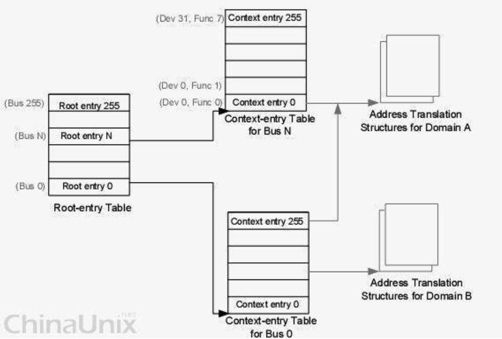
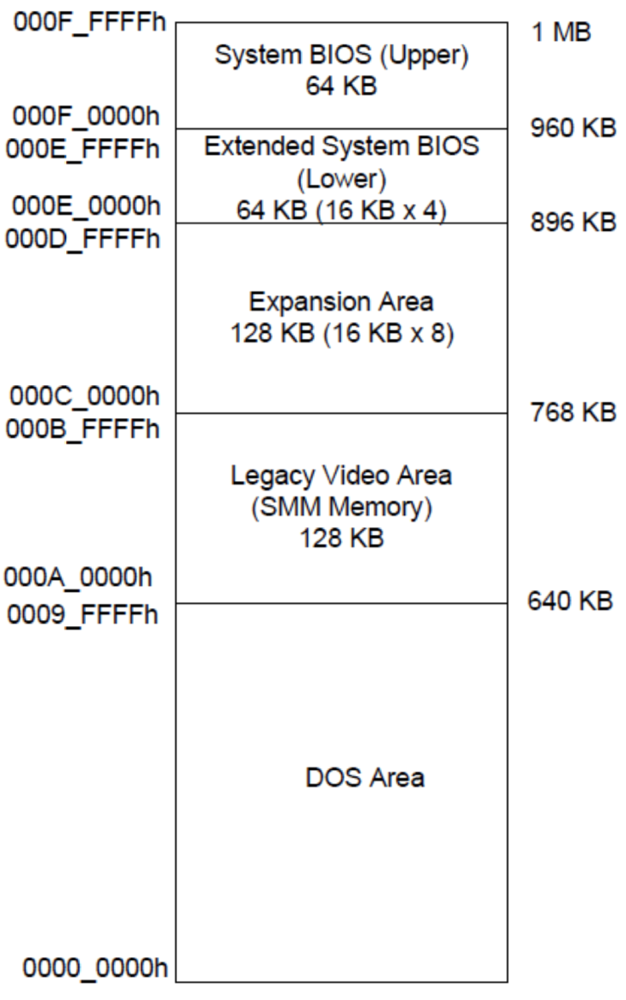
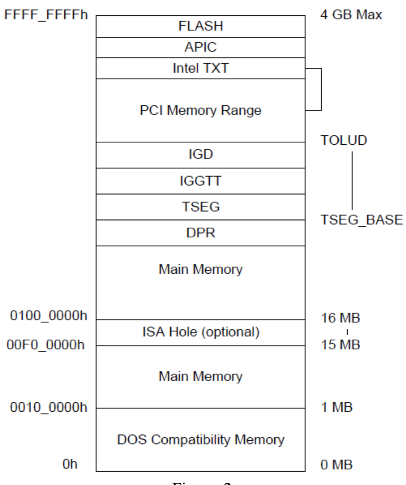
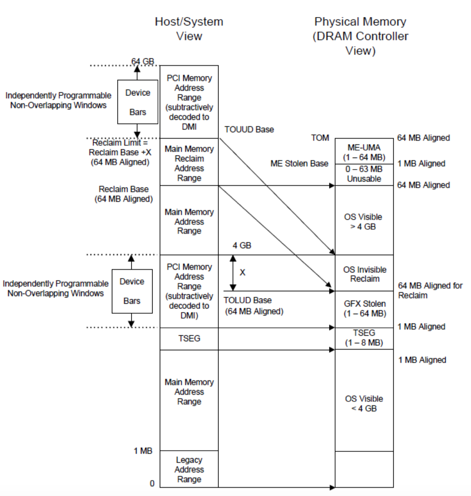
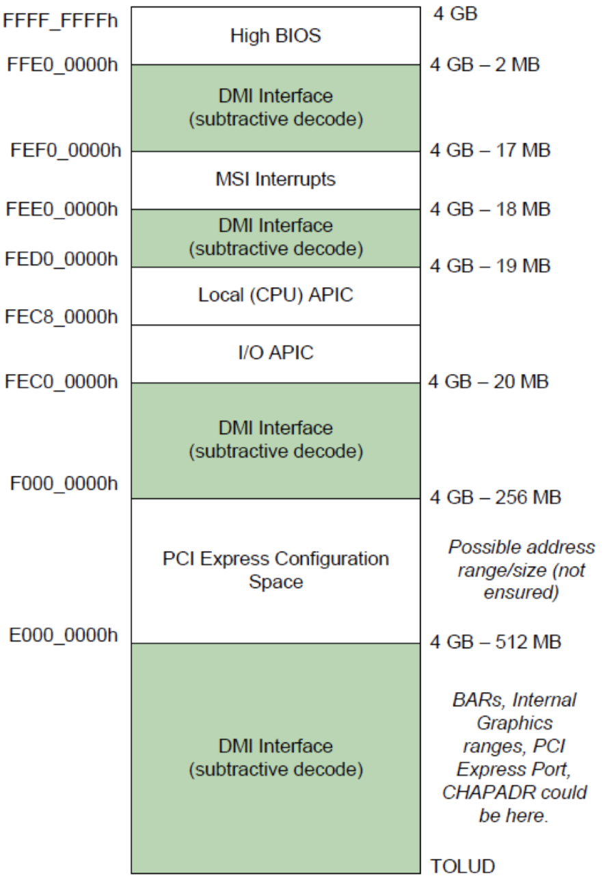
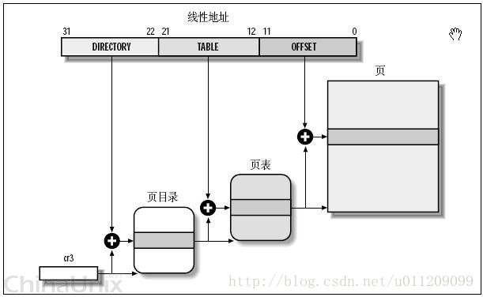
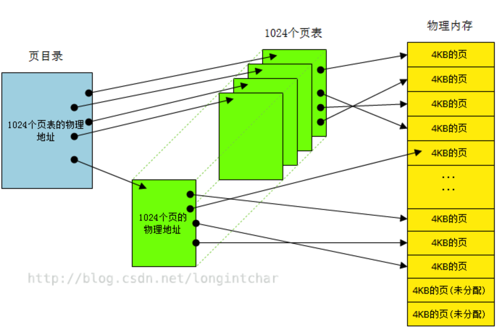
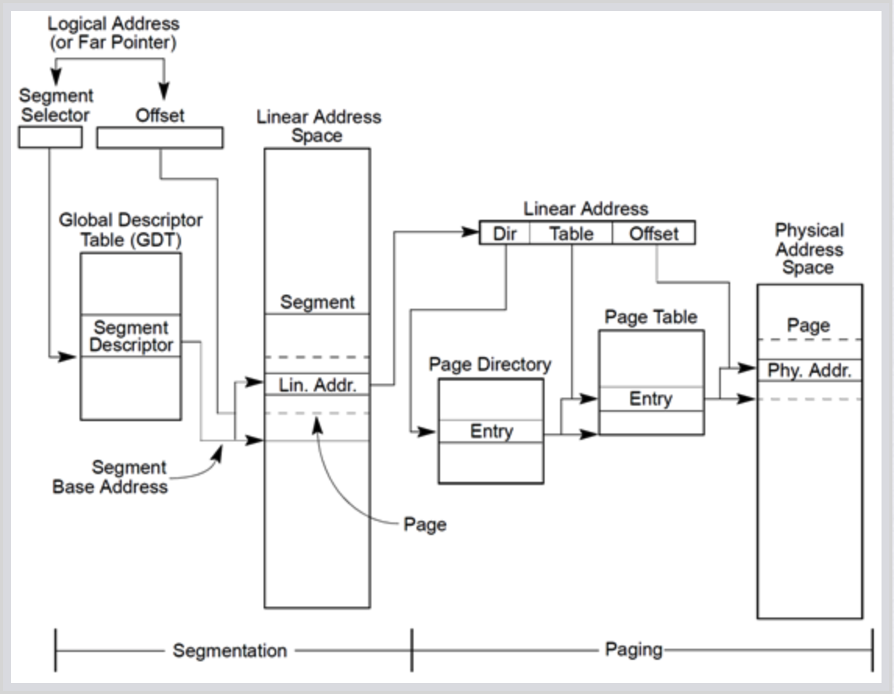
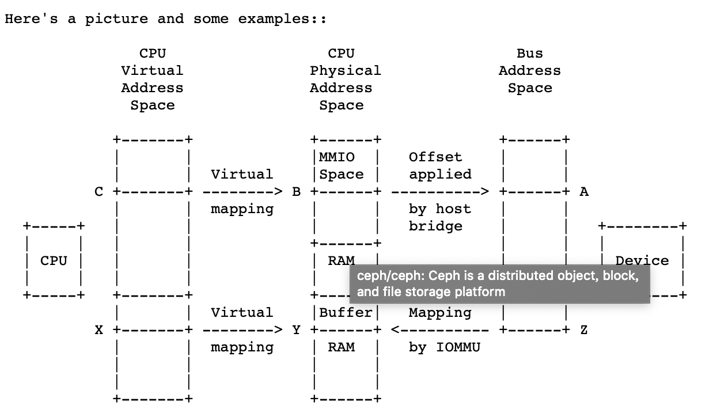
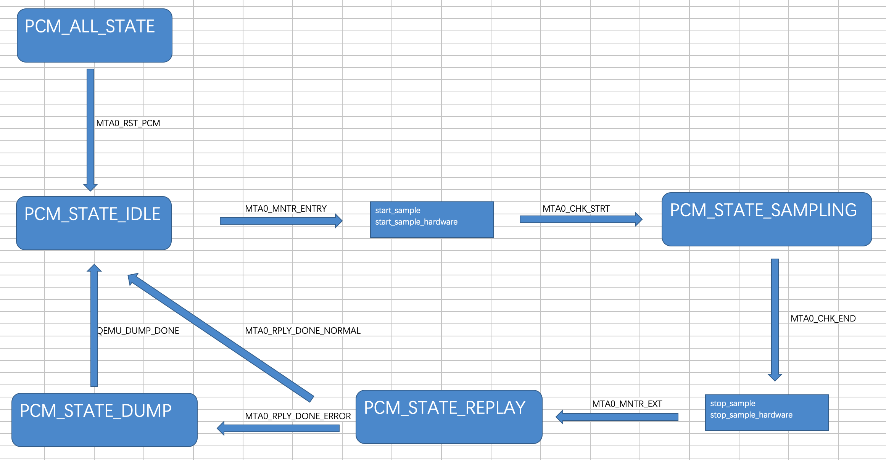

- Glossary
    - Hypervisor
        - Hypervisor是一种运行在物理服务器和操作系统之间的中间软件层，可允许多个操作系统和应用共享一套基础物理硬件，因此也可以看作是虚拟环境中的“元”操作系统，它可以协调访问服务器上的所有物理设备和虚拟机，也叫虚拟机监视器（Virtual Machine Monitor）
    - OSS
        - Ordinary Software Stack
        - 用户可见的操作系统及软件堆栈
    - VMM
        - Virutal Machine Monitor
    - PCM
        - Platmform Checking Module
        - Brief
            - assist in sampling
        - Functions
            - Utilize CPU virtualization features
            - Base on KVM
        - 定位
            - PCM从功能定位上为一个扩展的服务器平台固件（An Extended BIOS Firmware），一方面它能利用底层Memory Trace、I/O Trace以及RCP等硬件机制实现CPU安全检测验证功能
            - 另一方面它又要承担硬件资源管理的角色，面向用户提供一个与普通服务器几乎一致的计算环境（即让用户感受到的除了增加CPU安全检测功能之外，在其它应用体验方面没有什么本质的差异）
        - 实现
            - 基于KVM的Thin Hypervisor（VMM），当前采用的基础版本为CentOS 7.4（Linux 3.10.0-693）以及QEMU 2.5.0
        - 具体功能
            - 系统信息功能、系统参数设置功能、系统固件更新功能、系统诊断与自检测试功能、CPU动态安全检测日志管理功能、OSS硬件资源配置管理以及OSS操作系统的部署安装等
            - 硬件资源管理
                - 只支持一个虚拟执行环境，即只支持同时运行一个OSS
                - 除了少数低速的设备以虚拟方式呈现(如鼠标，键盘等)外，其它大部分设备尽可能的以 Passthrough透传的方式呈现，即极大化降低PCM固件所带来的性能开销及透明性
            - CPU动态安全检测支持
                - 支持对运行中的OSS进行快照(主要包括CPU状态信息)
                - 支持对OSS采样执行，即采样执行期间要记录CPU所遇到发生的特定行为事件(不确定性指令、外部中断等)、内存以及I/O的存取行为事件
                - 支持与Memory Trace(MTR)、I/O Trace(ITR)以及RCP等硬件通信，一起协作完成对XEON志 强周期性采样及重放安全检测功能(基于周期性间隔采样方式)
        - 发行版的制作
            - PCM本质上与标准Linux操作系统一样，开发完成之后需要制作发行版本，以便用户尤其是OEM厂商可以部署安装到基于JintideTM处理器的安全服务器平台上。发行版制作主要涉及PCM内核裁剪、PCM基础运行环境软件包的精简、PCM UI配置管理模块软件包的制作、OEM信息的定制等。
        - 软件包裁剪
            - PCM作为一个扩展的BIOS，在实现上来讲是一个基于KVM的Thin Hypervisor，其运行环境使用的是CentOS 7.4这个Linux
        - 部署安装
            - 在JintideTM系统物理硬件配置中，有专门预留了一个PCIe M.2 SSD接口，PCM就需要部署安装在此介质上
        - PCM系统分区   
            - EFI system partition	包含Bootloader
            - RootFS(mounted RO)	包含PCM，OS相关库程序，工具，系统应用以及GUI等
            - Data (mounted RW)		用于存放PCM Log，GUI设置以及OEM配置信息等
    - RCP
        - Reconfigrurable Computing Processor
        - 与PCM和ITR进行通信
        - 基于获取的采样数据进行重放验证，实现CPU执行行为的动态安全检测
        - 提供了Offloading加速处理功能，由PCM的资源管理引擎Passthrough到OSS
    - MTR
        - Memory Tracer
        - 内嵌于LRDIMM存储芯片，支持对内存访存行为的Trace，具体信息包括：存储地址、读或写行为、存取数据。

    - ITR
       - IO tracer
    - 采样
        - 采样内容
            - 采样系统快照
            - 采样执行事件日志记录（包括CPU、内存及I/O）
    - SRIOV
        - VT-d 的性能非常好，但是它的物理设备只能分配给一个客户机使用。为了实现多个虚机共享一个物理设备，并且达到直接分配的目的，PCI-SIG 组织发布了 SR-IOV （Single Root I/O Virtualization and sharing） 规范，它定义了一个标准化的机制用以原生地支持实现多个客户机共享一个设备。不过，目前 SR-IOV （单根 I/O 虚拟化）最广泛地应用还是网卡上。 
        - 功能
            - 物理功能（Physical Functions，PF）：这是完整的带有 SR-IOV 能力的PCIe 设备。PF能像普通PCI设备那样被发现、管理和配置。
            - 虚拟功能（Virtual Functions，VF）：简单的 PCIe 功能，它只能处理I/O。每个VF都是从PF中分离出来的。每个物理硬件都有一个VF数目的限制。一个PF，能被虚拟成多个VF用于分配给多个虚拟机。

    - VFIO
        - 
    - PCI Pass-through
        - 允许将宿主机中的物理 PCI 设备直接分配给客户机使用。较新的x86平台已经支持这种类型，Intel 定义的 I/O 虚拟化技术成为 VT-d，AMD 的称为 AMD-V。KVM 支持客户机以独占方式访问这个宿主机的 PCI/PCI-E 设备。通过硬件支持的 VT-d 技术将设备分给客户机后，在客户机看来，设备是物理上连接在PCI或者PCI-E总线上的，客户机对该设备的I/O交互操作和实际的物理设备操作完全一样，不需要或者很少需要 KVM 的参与。运行在 VT-d 平台上的 QEMU/KVM，可以分配网卡、磁盘控制器、USB控制器、VGA 显卡等设备供客户机直接使用。
    - MSR  
        - MSR（Model Specific Register）是x86架构中的概念，指的是在x86架构处理器中，一系列用于控制CPU运行、功能开关、调试、跟踪程序执行、监测CPU性能等方面的寄存器。
    - 异常
        - 与中断相比，异常的最大不同在于它是在程序的执行过程中同步发生的。例如除0
        - 异常按原因和严重程度可以分为如下3类
            - 错误（Fault）
                - 由某种错误情况引起，一般可以被错误处理程序纠正。错误发生时，处理器将控制权限转移给对应的处理程序。例如，常见的缺页错误就属于此。
            - 陷阱（Trap）
                - 指在执行了一条特殊指令后引起的异常。例如，linux中用于实现系统调用的INT80 就属于此类。
            - 终止（Abort）
                - 指严重的不可恢复的错误，将导致程序终止的异常。例如MCA（Machine Check Architecture）
    - 中断
        - 从物理学的角度看，中断是一种电信号，由硬件设备产生，并直接送入中断控制器（如 8259A）的输入引脚上，然后再由中断控制器向处理器发送相应的信号。处理器一经检测到该信号，便中断自己当前正在处理的工作，转而去处理中断。此后，处理器会通知 OS 已经产生中断。这样，OS 就可以对这个中断进行适当的处理。不同的设备对应的中断不同，而每个中断都通过一个唯一的数字标识，这些值通常被称为中断请求线。
        - 软件层面
            - 每一个中断对应中断向量表中的一个函数，有优先级的概念
        - 硬件层面
            - 中断硬件部分就是产生中断脉冲，传给中断控制器，然后通知CPU，CPU在执行下调指令前会去查询中断情况，如果有中断信号，就执行中断
        - 中断处理流程
            - 中断从某个设备发出，送到IOAPIC。IOAPIC查PRT表找到对应的表项PTE，得知目标LAPIC。于是格式化出中断消息发送给LAPIC，通知置remote irr为1(level)。
            - LAPIC收到中断消息后，根据向量号设置IRR后，进行中断选取，取得取得优先级最高的中断后，清除IRR，设置ISR，提交CPU进行中断处理，CPU处理完中断后，写LAPIC的EOI，通知IOAPIC清除remote irr(level且deassert)。”
        - 中断分类
            - NMI
                - Non maskable interrupt
                - NMI 是不可屏蔽中断，它通常用于电源掉电和物理存储器奇偶校验
            - INTR
                - 可屏蔽中断请求
                - 它主要用于接受外部硬件的中断信号，这些信号由中断控制器传递给 CPU。
        - APIC
            - 8259A 只适合单 CPU 的情况，为了充分挖掘 SMP 体系结构的并行性，能够把中断传递给系统中的每个 CPU 至关重要。基于此理由，Intel 引入了一种名为 I/O 高级可编程控制器的新组件，来替代老式的 8259A 可编程中断控制器
            - 分为本地APIC（每一个CPU一个）和I/O APIC，收集来自 I/O 装置的 Interrupt 信号且在当那些装置需要中断时发送信号到本地 APIC，系统中最多可拥有 8 个 I/O APIC
            - PRT
                - 根据其内部的PRT（Programmable Redirection Table）表，IOAPIC可以格式化出一条中断消息，发送给某个CPU的LAPIC，由LAPIC通知CPU进行处理。
            - PTE
                - 目前典型的IOAPIC具有24个中断管脚，每个管脚对应一个RTE（Redirection Table Entry，PRT表项）
        - MSI
            - Message Signaled Interrupts (MSI) are an alternative in-band method of signaling an interrupt, using special in-band messages to replace traditional out-of-band assertion of dedicated interrupt lines.
            - On Intel systems, the LAPIC must be enabled for the PCI (and PCI Express) MSI/MSI-X to work, even on uniprocessor (single core) systems.[10][11] In these systems, MSIs are handled by writing the interrupt vector directly into the LAPIC of the processor/core that needs to service the interrupt. The Intel LAPICs of 2009 supported up to 224 MSI-based interrupts.[11] According to a 2009 Intel benchmark using Linux, using MSI reduced the latency of interrupts by a factor of almost three when compared to I/O APIC delivery.[12]
            - MSI可以允许设备直接发送中断到Local APIC，不需要通过中断控制器（I/O APIC）
        - 虚拟中断源
            - 处理器内部中断源的模拟，例如LAPIC时钟、处理器间中断等
            - 外部虚拟设备的模拟，例如8254（定时器）、RTC、IDE、网卡和电源管理模块等
            - 直接分配给虚拟机使用的真实设备的中断，通常来自于VMM中断服务程序
            - 自定义中断类型
        - 虚拟I/O APIC
            - 操作系统通过MMIO的方式访问I/O APIC，因此VMM的实现和虚拟PIC有所同。VMM会将虚拟PIC的MMIO地址对应的页表项置为“该页不存在”，因此，当客户机访问对应的MMIO寄存器时，就会发生Page Fault的VM-exit。这样，VMM就能截获客户机对虚拟I/O APIC的访问，进而正确的虚拟化。
        - PIC处理流程
            - IRQ0-IRQ7的其中一个引脚收到一个中断信号，则设置IRR中对应的bit
            - 8259A通过INT信号线向CPU发送中断信号
            - CPU收到INT信号后，发出一个INTA信号，输入8259A的INTA输入引脚
            - 将IRR中的bit清除，在ISR中设置对应的bit
            - CPU在下一个周期再发出一个INTA信号，输入8259A的INTA输入引脚，此时8259A通过数据总线向CPU发送Interrupt Vector
            - 最后，若处于AEOI模式，ISR中的bit直接清除，否则要等CPU处理完该中断后，向8259A进行一次EOI，才能将ISR中的bit清除
        - APIC
            - APIC由本地APIC、APIC总线（ICC bus）、IO APIC组成
            - 本地APIC接收该处理器产生的本地中断比如时钟中断，以及由该处理器产生的处理器间中断，并从APIC串行总线接收来自IO APIC的消息；
            - IO APIC负责接收所有外部的硬件中断，并翻译成消息选择发给接收中断的处理器，以及从本地APIC接收处理器间中断消息。 
        - MSI如何工作
            - MSI通过直接访问LAPIC来发送中断请求
    - PCI
        - 外部链接（Peripheral Component Interconnect）标准
        - 常见的PCI卡包括网卡、声卡、调制解调器、电视卡和硬盘控制器等，另外还有USB和串列端口等端口。原本显卡通常也是PCI设备，但很快其频宽已不足以支持显卡的性能。PCI显卡现在仅用在需要额外的外接显示器或主板上没有AGP和PCI Express槽的情况
        - PCI中断的最大特点是可以共享。PCI bus有四条中断线，所有PCI device共同使用这4条线向系统申请中断。共有4种 PCI中断，分别为INTA#、INTB#、INTC#和INTD#。
    - PCIe
        - PCI Express，简称PCI-E，官方简称PCIe是计算机总线PCI的一种，它沿用现有的PCI编程概念及通信标准，但建基于更快的串行通信系统。
    - FIR
        - FIR是指快速中断模式
    - 中断注入
        - 对于OSS的外部中断是在VM Enter时注入的，OSS真正看见的所发生的也是 注入的中断，因此执行在VM Enter时检测有什么外部中断并进行记录即可
        - VMM中断处理函数截获，外设的中断，在中断处理函数中检查，发现该中断是分配给客户机的设备产生等饿，因此VMM调用虚拟中断控制器接口函数，将中断发送给虚拟Local APIC。之后，虚拟 Local APIC就会在适当的时机将中断注入给客户机，由客户机操作系统处理函数处理。
    - Single-step interrupt
        - When a system is instructed to single-step, it will execute one instruction and then stop. The contents of registers and memory locations can be examined; if they are correct, the system can be told to go on and execute the next instruction. 
    - 系统调用
        - 指运行在用户空间的程序向操作系统内核请求需要更高权限运行的服务。系统调用提供用户程序与操作系统之间的接口。大多数系统交互式操作需求在内核态运行。如设备IO操作或者进程间通信。
    - 用户空间和内核空间
        - 在操作系统中，虚拟内存通常会被分成用户空间（英语：User space，又译为使用者空间），与核心空间（英语：Kernel space，又译为内核空间）这两个区块。这是存储器保护机制中的一环。内核、核心扩展（kernel extensions）、以及驱动程序，运行在核心空间上。而其他的应用程序，则运行在用户空间上。所有运行在用户空间的应用程序，都被统称为用户级
    - MMU
        - A memory management unit (MMU), sometimes called paged memory management unit (PMMU), is a computer hardware unit having all memory references passed through itself, primarily performing the translation of virtual memory addresses to physical addresses. 
    - IOMMU
        - 在计算机领域，输入输出内存管理单元（英语：input–output memory management unit，缩写IOMMU）是一种内存管理单元（MMU），它将具有直接存储器访问能力（可以DMA）的I/O总线连接至主内存。如传统的MMU（将CPU可见的虚拟地址转换为物理地址）一样，IOMMU将设备可见的虚拟地址（在此上下文中也称设备地址或I/O地址）映射到物理地址。部分单元还提供内存保护功能，防止故障或恶意的设备。
        - trans bus address to physical address
        - IOMMU主要提供两个功能
            - DMA映射
                - IOMMU出现之前，设备DMA操作可以操作到整个操作系统内存空间
                - 将透传设备DMA操作的地址空间，映射到固定的物理地址空间
                -  
            - 中断重映射
                - 设备发起的msi中断先进入iommu的intremap模块进行映射得到真正的msi中断信息。
                - 主机os会在这个中断重映射表里限定，某个设备只能发起哪种中断向量，同时会验证msi中的信息位（如此提升了恶意软件触发真实msi的难度）
            - 参照 https://www.jianshu.com/p/dd8ab6b68c6a
    - x86 memory map
    - 参照 https://firmware.intel.com/sites/default/files/resources/A_Tour_Beyond_BIOS_Memory_Map_in%20UEFI_BIOS.pd
     
     
     
     
      
  
    - 影子页表
        - 软件层面的MMU，实现GPA到HPA的转换
        - 当访问到CR3寄存器的时候（可能是由于Guest进程后导致的），KVM捕获到这个操作，CPU虚拟化章节 EXIT_REASON_CR_ACCESS，qemu-kvm通过载入特俗的CR3和影子页表来欺骗Guest这个就是真实的CR3，后面的操作就和传统的访问内存的方式一致，当需要访问物理内存的时候，只会经过一层的影子页表的转换。
    - CR3是页目录基址寄存器，保存页目录表的物理地址，页目录表总是放在以4K字节为单位的存储器边界上，因此，它的地址的低12位总为0，不起作用，即使写上内容，也不会被理会。
    - 保护模式
        - 软件上的分段、分页，则是CPU在保护模式下，即操作系统启动后所采用的内存寻址方式
        - 操作系统(system模块中的head.s程序)接管CPU后，会使CPU进入保护模式.
        - 包括CPU权限分级. 多任务，内存分页等各种功能。
    - 实模式
        - 硬件上的分段、分页，是针对CPU在实模式下，即操作系统尚未加载启动之前所采用的内存寻址方式
        - 不能使用多线程。不能实现权限分级。还不能访问20位以上地址线,也就是说只能访问1M内存(!!!)
        - 地址转换公式是：物理地址 = 线性地址 = 段地址*16 + 段偏移
    - EPT硬件加速的虚拟化方式
        - 硬件层面的MMU，实现GPA到HPA的转换
    - 特权指令
        - 从操作系统角度谈特权指令
        - 通常指系统中的一些操作和管理关键系统资源的指令，只有在最高特权级上能够正确运行；
        - 如果在非最高特权级上运行，特权指令会引发一个异常，处理器会陷入到最高特权级，交由系统软件处理；
    - 敏感指令
        - 从虚拟化的角度谈敏感指令
        - 包含
            - 修改虚拟机的运行模式或者下面物理机的状态；
            - 读写时钟、中断等寄存器；
            - 访问存储保护系统、地址重定位系统及所有的I/O指令。
    - GDT （Global Descriptor Table）
        - 在整个系统中，全局描述符表GDT只有一张(一个处理器对应一个GDT)，GDT可以被放在内存的任何位置，但CPU必须知道GDT的入口，也就是基地址放在哪里，Intel的设计者门提供了一个寄存器GDTR用来存放GDT的入口地址，程序员将GDT设定在内存中某个位置之后，可以通过LGDT指令将GDT的入口地址装入此寄存器，从此以后，CPU就根据此寄存器中的内容作为GDT的入口来访问GDT了。
        - 详细 http://www.techbulo.com/708.html
    - LDT 局部描述符表LDT（Local Descriptor Table）局部描述符表可以有若干张，每个任务可以有一张。我们可以这样理解GDT和LDT：GDT为一级描述符表，LDT为二级描述符表。
    - 段描述符
        - 段描述符是GDT和LDT表中的一个数据结构项，用于向处理器提供有关一个段的位置和大小信息以及访问控制的状态信息。
    - 页表
        - 用来将虚拟地址空间映射到物理地址空间的数据结构称为页表
        - https://blog.csdn.net/longintchar/article/details/52072253
        
        
    - 段管理和页管理的联系
        
    - 逻辑地址、线性地址、物理地址
        - 逻辑地址 = [段选择符：段内偏移地址]，查找GDT或者LDT（通过寄存器gdtr，ldtr）找到描述符，通过段选择符(selector)前13位在段描述符做index，找到Base地址，Base+offset就是线性地址。
        - 线性地址：
        - 物理地址：线性地址通过分页机制，映射到物理内存地址。CPU使用的内存地址
        - 虚拟地址：进程看到的内存地址
        
    - 页表和GDT/LDT的关系
        - X86 有两种内存管理模型
            - 基于段管理使用GDT&LDT
            - 基于页管理使用页表
            - https://www.ibm.com/developerworks/cn/linux/l-memmod/index.html
    - 内核线程
        - 直接由内核本身启动的进程，内核线程实际上是将内核函数委托给独立的进程，与系统中其他进程并行执行
        - 作用  
            - 周期性的将修改的内存页与页来源块设备同步（mmap等）
            - 如果内存页缺少使用，则写入交换区
            - 管理延时动作
            - 实现文件系统的事务日志
    - 进程地址空间的布局
        - 当前运行代码的二进制代码。该代码通常称之为text，所处的虚拟内存区域称之为text段
        - 程序使用的动态库代码
        - 存储全局变量和动态产生的数据的堆
        - 用于保存局部变量和实现函数/过程调用的栈
        - 环境变量和命令行参数的段
        - 将文件内容映射到虚拟地址空间中的内存映射
    - SMI
        - System Management Interrupt
    - SS 
        - SS is the stack-segment register. It points to the general area of memory that will be used for the stack.
    - ESP
        - ESP is the stack pointer register. It points to the precise location which is at any given point the 'top' of the stack, within the 'stack segment' area of memory.
    - STI
        - SET IF = 1， 允许可屏蔽中断
    - PFN
        - page frame number
    - IRR
        - Interrupt Request Register，中断请求寄存器，当某个管脚的中断请求到来后，若该管脚没有被屏蔽， IRR 中对应的 bit 被置一。表示 PIC 已经收到设备的中断请求，但还未提交给CPU
    - ISR
        - 服务中寄存器，共8bit，每 bit 意义同上。当 IRR 中的某个中断请求被发送给 CPU 后，ISR 中对应的 bit 被置一。表示中断已发送给 CPU，但 CPU还未处理完。
    - IRQ
        - IRQ 是 PIC 时代的产物，由于 ISA 设备通常是连接到固定的 PIC 管脚，所以说一个设备的 IRQ 实际是指它连接的 PIC 管脚号。IRQ 暗示着中断优先级，例如IRQ0 比 IRQ3 有着更高的优先级。
    - GSI
        - GSI 是 ACPI 引入的概念，全称是 Global System Interrupt。它为系统中每个中断源指定管脚的GSI=GSIbase+pin，故IOAPIC0的GSI范围为[0~23]。IOAPIC1有16个管脚，GSI base 一个唯一的中断号
    - IDT
        - IDT，Interrupt Descriptor Table，中断描述符表是CPU用来处理中断和程序异常的。
        - Vector
            - Vector是 CPU 的概念， 是中断在IDT表中的索引。
    - INSTRUCTION BOUNDARY
        - X86的指令执行需要多个cycle，指令和指令之间不能被中断打断，指令边界指的就是执行完一条指令之后，执行下一条指令之前，中断不能打断指令执行，也就是需要执行完当前指令，再执行中断
    - MMIO
        - Memory-mapped I/O uses the same address space to address both memory and I/O devices.
        - 需要进行ioremap，iounmap操作
        - 访问内存的函数有readb、readw、readl等
        - ioremap
            - A successful call to ioremap() returns a kernel virtual address corresponding to start of the requested physical address range.
        - cpu从pci设备的bar读出总线地址，转换成CPU的物理地址
        - pci设备的内存空间配置好了物理地就能在kernel中通过ioremap映射到内核的虚拟地址空间上去正常使用了。
        - DMA processes  
            - during device enumeration, map device bus address (A) to phy addr (B)
            - by ioremap(), map phy addr (B) to virt addr (C)  
            - if support DMA, kmalloc() a buf in virt (X), and virt (X) auto mapped phy addr (Y)
            - by dma_map_single(), virt (X) mapped to bus addr (Z)
            - driver tells device to do DMA to (Z), and IOMMU mapped it to phy (Y)

        - https://www.kernel.org/doc/Documentation/DMA-API-HOWTO.txt
         

    - PIO
        - Port io采用独立的地址空间
        - 使用IN/OUT指令来操作外设
    - MMAP
        - 内存映射文件
        - mmap(2) is a POSIX-compliant Unix system call that maps files or devices into memory. 
    - Memory-mapped file
        - A memory-mapped file is a segment of virtual memory that has been assigned a direct byte-for-byte correlation with some portion of a file or file-like resource. 

    
    - 访问截获
        - 非直接分配设备
            - 客户机是否能够访问给定I/O端口由I/O端口位图来决定，VMM可以把所有设备从I/O位图中关闭，这样客户机指令流在访问该I/O端口资源时，物理处理器CPU就会即时抛出一个异常，接着VMM就可以获得异常原因，然后将请求发送给设备模拟器进行模拟
            - 如果设备可以产生中断，VMM需要保证设备模拟器在收到物理中断并需要触发中断时，可以通知虚拟中断逻辑，然后由虚拟中断逻辑模拟一个虚拟中断注入
            - 物理地址空间的访问是通过页表来控制的，因此物理处理器遍历的真实页表里，VMM只要把映射该MMIO的页表项设为无效，当客户机指令试图访问目标地址时，物理处理器就会抛出一个缺页异常，接着VMM遍历客户页表，就可以发现所属的MMIO资源，然后将请求发送给设备模拟器进行模拟。
        - 直接分配设备
            - VMM可以把该设备所属I/O从I/O位图中打开，这样处理器就会把访问发送到系统总线上，最终达到物理设备，而不被模拟
            - VMM物理中断处理函数在收到物理中断后，辨认中断源属于哪个客户机，然后通知客户机的虚拟中断逻辑
            - 对于一个直接分配给客户机操作系统使用的设备，VMM只需要按照按照客户页表设置打开真实页表的映射即可，这样客户机操作系统对该设备的访问也不再被模拟。
        - DMA
            - 若设备模拟器的驱动没有修改，则设备模拟器收到的DMA目标地址是客户机的物理地址。因此，VMM需要提供一种机制，让设备模拟器可以了解各种地址之间的转换关系，从而可以把客户机物理地址应设成自己的虚拟地址，就能真正做到对DMA目标地址的访问了。
    - IRQ
        - Interrupt Request，IRQ是PIC时代的产物，由于ISA设备通常是连接到固定的PIC管脚，所以说一个设备的IRQ实际是指它连接的PIC管脚号。IRQ暗示着中断优先级，例如IRQ0比IRQ3有着更高的优先级。
    - GSI
        - GSI是ACPI引入的概念，全称是Global System Interrupt。它为系统中每个中断源指定一个唯一的中断号.
        - 有3个IOAPIC：IOAPIC0~2。IOAPIC0有24个管脚，其GSI base为0，每个管脚的GSI=GSI base + pin，故IOAPIC0的GSI范围为[0~23]。IOAPIC1有16个管脚，GSI base为24，GSI范围为[24,39]，依次类推。ACPI要求ISA的16个IRQ应该被identify map到GSI的[0,15]。
    - SI
        - 存储器指针、串指令中的源操作数指针
    - DI
        - 存储器指针、串指令中的目的操作数指针
    - BP
        - 存储器指针、存取堆栈的指针
    - SP
        - 堆栈的栈顶指针
    - 自旋锁
        - 自旋锁在内核中主要用来防止多处理器中并发访问临界区，防止内核抢占造成的竞争。
        - a spinlock is a lock which causes a thread trying to acquire it to simply wait in a loop ("spin") while repeatedly checking if the lock is available.
        - the use of such a lock is a kind of busy waiting.
        - spin_lock
            - 只禁止内核抢占，不会关闭本地中断
        - spin_lock_irq
            - 禁止内核抢占，且关闭本地中断
        - spin_lock_irqsave
            - 保存本地中断状态(这里的本地即当前的cpu的所有中断)
            - 关闭本地中断
            - 获取自旋锁 
    - 虚拟机中的前端/后端
        - 前端
            - 客户机操作系统中的驱动程序成为前端设备驱动
        - 后端
            - VMM中的驱动程序为后端驱动程序
    - 物理地址
        - CPU用
    - 总线地址
        - PCI设备用，DMA操作
    - 虚拟地址
        - 进程用
    - 虚拟化Type1和Type2的区别
        - type1: Hardware -> Hypervisor -> VM
        - type2: Hardware -> Operating System -> Hypervisor -> VM
    - INVVPID
        - Invalidates entries in the TLBs and paging-structure caches based on VPID 
        - As detailed in Section 29.4.5, an access to the APIC-access page might not cause an APIC-access VM exit if software does not properly invalidate information that may be cached from the paging structures. If, at one time, the current VPID on a logical processor was a non-zero value X, it is recommended that software use the INVVPID instruction with the “single-context” INVVPID type and with VPID X in the INVVPID descriptor before a VM entry on the same logical processor that establishes VPID X and either (a) the “virtualize APIC accesses” VM-execution control was changed from 0 to 1; or (b) the value of the APIC-access address was changed.

- 背景
    - 基准平台
        - Intel Neon City
    - 津逮（JintideTM）系统是清华、澜起和Intel利用各自优势共同协作推出的一套全新的服务器安全解决方案
        - 基于完整信任链的安全引导启动
        - CPU行为动态安全检测
        - Offloading加速
    - Trace 事件日志种类
        - CPU相关事件
            - CPU不确定性指令
            - 外部中断事件(APIC)
        - 内存相关事件
            - 各种读写行为
        - 外部I/O相关事件
            - MMIO
            - PIO
            - DMA
                - 对于标准I/O的DMA操作，借助于FIR中断请求，通知PCM发生DMA操作，由PCM负责事件的记录，ITR硬件负责I/O数据的存储记录
    - Trace事件日志属性分类
        - 同步指令事件
            - rdseed，rdrand，rdtsc，rdtscp，rdpmc，cupid read，msr read，pio，mmio
            - Intel SDM第三册系统编程手册的第二十五章， CHAPTER 25 VMX NON-ROOT OPERATION，这些指令要么缺省情况下执 行时就会产生VM Exit，要么需要对VMCS的Exec Control Area相应的字段域 进行设置使其执行时产生VM Exit，从而使得PCM Hypervisor有机会跟踪到 这些事件行为。
        - 异步行为事件
            - 外部中断事件
            - DMA操作
            - FIR
    - 内存及CPU快照原理    
        - 通过在QEMU中设计创建两个用户级存储线程，它能够将采样期间通过KVM保存在系统保留内核空间中的CPU或Memory状态、事件日志信息拷贝复制保存到共享内存或离线文件中，达到存取系统快照的目的

- qemu 内存访问过程
    - guest virtual addr (GVA) → guest physical addr (GPA) → host virtualaddr (HVA)。其中 GVA->HVA 由 qemu 负责完成,HVA->HPA 由 host 操作系统完成。
- 问题
    - 19 IO control
    - 3 event
    - 为什么qemu里面启动timer
        - pcm_start_timer_cb
- 基础
    - mmap
        - 概念
            - 将内核空间的一段内存区域映射到用户空间。映射成功后，用户对这段内存区域的修改可以直接反映到内核空间，相反，内核空间对这段区域的修改也直接反映用户空间。
        - 应用
            - 提高I/O效率
                - 驱动：首先在驱动程序分配一页大小的内存，然后用户进程通过mmap()将用户空间中大小也为一页的内存映射到内核空间这页内存上。映射完成后，驱动程序往这段内存写10个字节数据，用户进程将这些数据显示出来。
            - 匿名内存映射
                - 匿名映射实现父子进程通信
            - 共享内存进程通信
                - 两个程序映射同一个文件到自己的地址空间, 进程A先运行, 每隔两秒读取映射区域, 看是否发生变化。进程B后运行, 它修改映射区域, 然后退出, 此时进程A能够观察到存储映射区的变化。
    - kvm vcpu
        - 以 Intel VT 技术为例，它增加了两种运行模式：VMX root 模式和 VMX nonroot 模式。通常来讲，主机操作系统和 VMM 运行在 VMX root 模式中，客户机操作系统及其应用运行在 VMX nonroot 模式中。因为两个模式都支持所有的 ring，因此，客户机可以运行在它所需要的 ring 中（OS 运行在 ring 0 中，应用运行在 ring 3 中），VMM 也运行在其需要的 ring 中 （对 KVM 来说，QEMU 运行在 ring 3，KVM 运行在 ring 0）。CPU 在两种模式之间的切换称为 VMX 切换。从 root mode 进入 nonroot mode，称为 VM entry；从 nonroot mode 进入 root mode，称为 VM exit。可见，CPU 受控制地在两种模式之间切换，轮流执行 VMM 代码和 Guest OS 代码。
        - 对 KVM 虚机来说，运行在 VMX Root Mode 下的 VMM 在需要执行 Guest OS 指令时执行 VMLAUNCH 指令将 CPU 转换到 VMX non-root mode，开始执行客户机代码，即 VM entry 过程；在 Guest OS 需要退出该 mode 时，CPU 自动切换到 VMX Root mode，即 VM exit 过程。可见，KVM 客户机代码是受 VMM 控制直接运行在物理 CPU 上的。QEMU 只是通过 KVM 控制虚机的代码被 CPU 执行，但是它们本身并不执行其代码。也就是说，CPU 并没有真正的被虚级化成虚拟的 CPU 给客户机使用。
        -  一个普通的 Linux 内核有两种执行模式：内核模式（Kenerl）和用户模式 （User）。为了支持带有虚拟化功能的 CPU，KVM 向 Linux 内核增加了第三种模式即客户机模式（Guest），该模式对应于 CPU 的 VMX non-root mode。
        - User mode 中的 QEMU-KVM 会通过 ICOTL 命令来运行虚拟机
        - KVM 内核模块收到该请求后，它先做一些准备工作，比如将 VCPU 上下文加载到 VMCS （virtual machine control structure）等，然后驱动 CPU 进入 VMX non-root 模式，开始执行客户机代码
    - kvm ioctrl API
        - System ioctls: These query and set global attributeswhich affect the whole kvm subsystem.  In addition a system ioctl is used to create virtual machines
        - VM ioctls: These query and set attributes thataffect an entire virtual machine, for example memory layout.  In addition a VM ioctl is used to create virtual cpus (vcpus). Only run VM ioctls from the same process(address space) that was used to create the VM.
        - vcpu ioctls: These query and set attributes thatcontrol the operation of a single virtual cpu. Only run vcpu ioctls from the same threadthat was used to create the vcpu.
    - kvm init
        - 需要重点关注内核中的vmx_x86_ops，这个包含虚拟机创建相关操作
    - VMCS
        - Access to the VMCS is managed through a component of processor state called the VMCS pointer (one per logical processor）
        - ORGANIZATION OF VMCS DATA
            - Guest-state area. Processor state is saved into the guest-state area on VM exits and loaded from there on VM entries.
            - Host-state area. Processor state is loaded from the host-state area on VM exits.
            - VM-execution control fields. These fields control processor behavior in VMX non-root operation. They
            - VM-exit control fields. These fields control VM exits.
            - VM-entry control fields. These fields control VM entries.
            - VM-exit information fields. These fields receive information on VM exits and describe the cause and the nature of VM exits. On some processors, these fields are read-only
        - VMCS Type
            - ordinary VMCS 
                - An ordinary VMCS can be used for VM entry but a shadow VMCS cannot.
            - shadow VMCS
                - The VMREAD and VMWRITE instructions can be used in VMX non-root operation to access a shadow VMCS but not an ordinary VMCS. 
            - In VMX root operation, both types of VMCSs can be accessed with the VMREAD and VMWRITE instructions.
        - 虚拟特权资源
            - 客户机看到的特权资源
        - 影子特权资源
            - 客户机运行时特权资源的真正值
    - 需要虚拟化的异常
        - 没有通用的方法，VMM会对不同的异常进行不同的处理
        - 已缺页异常为例
            - 访问MMIO地址导致的异常
                - 可以知道客户机在做IO操作，VMM会调用IO虚拟化模块来处理
            - 影子页导致的异常
                - VMM调用内存虚拟化模块处理
            - 其他原因
                - 客户机真正的缺页异常，异常会注入客户机，客户机操作系统自己负责处理
    - VM中的中断
        - 真正的物理中断
            - VMM首先读取 VM-Exit interrruption information 字段来获得中断信号，然后调用VMM中对应的中断处理函数
        - 客户机虚拟设备发生了虚拟中断
            - VMM在感知虚拟中断发生时，会用某种方法把虚拟中断的目标VCPU拖到VMM中，常用的方法是发一个IPI给运行该VCPU的物理CPU。然后VMM在IPI的处理函数中将改虚拟中断注入客户机，由客户机操作系统处理。
    - 中断注入
        - 它是指将中断写入VMCS对应的中断信息位，来实现中断的注入，中断注入有个一个标志性的函数 kvm_set_irq,这个是中断注入的最开始
    - 软中断
        - 软中断由当前进程产生
        - 软中断通常是一些I/O行为
        - 软中断不会直接中断CPU
        - 软中断是一种需要内核为正在运行的进程去做一些事情（通常为I/O）的请求
    - 时钟中断
        - 周期性发生的硬件中断，是实现任务调度的基础
- 时序
    - sample timer
    ```
    .mhandler.cmd = hmp_pcm_auto_test_timer
    ->hmp_pcm_auto_test_timer
    -->kvm_guest_auto_save_timer
    --->timer_new_us(QEMU_CLOCK_REALTIME,pcm_start_timer_cb,pcm_auto_test_info);
    --->timer_mod

    pcm_start_timer_cb
    ->cs->pcm_sample_flag = PCM_START_SAMPLE;
    ->qemu_cpu_kick
    -->qemu_cond_broadcast
    --->pthread_cond_broadcast //unblock pthread
    ---->qemu_cpu_kick_thread
    ----->cpu->thread_kicked = true;
    ----->pthread_kill(cpu->thread->thread, SIG_IPI);
    ```
    - sample 
    ```
    1. CPU/Memory内存系统采样执行结束状态信息
    2. 系统采样执行期间的Trace信息(相对于CPU和内存系统的外部事件激励)    
        * CPU非确定性指令执行事件信息
        * 外部中断事件信息
        * MMIO访存事件信息
        * I/O操作事件信息(如DMA之类的操作)

    qemu
    x86_cpu_common_class_init
    x86_cpu_realizefn
    qemu_init_vcpu
    ->qemu_kvm_start_vcpu
    -->qemu_thread_create
    --->qemu_kvm_cpu_thread_fn
    ---->kvm_cpu_exec(cpu, cpu->pcm_sample_flag);
    ----->kvm_vcpu_ioctl(cpu, KVM_RUN, &pcm_sample_flag);
    ------>trace_kvm_vcpu_ioctl  //推测这个函数需要在编译时候才能生成，当前无法静态查看
    ------>ioctl(cpu->kvm_fd, type, arg); //PCM_START_SAMPLE


    kernel 
    ->kvm_vcpu_ioctl
    -->copy_from_user(&sample_flag, argp, sizeof(sample_flag)
    -->kvm_arch_vcpu_ioctl_run
    --->pcm_queue_command(MTA0_MNTR_ENTRY, false); //false mean not kick 
    ---->spin_lock_irqsave
    ---->__queue_command(pcmd);
    ----->kvm_pcm_make_request(KVM_PCM_COMMAND, pcm_kvm);
    ------>set_bit(req, &kvm_pctrl(kvm)->pcm_requests);
    ---->pcm_kick_sample_vcpu
    ---->spin_unlock_irqrestore
    --->*sample_flag = PCM_NO_SAMPLE;
    -->copy_to_user(argp, &sample_flag, sizeof(sample_flag))

    //接上面对MTA0_MNTR_ENTRY命令进行处理
    kvm_arch_vcpu_ioctl_run
    ->vcpu_run
    -->vcpu_enter_guest
    --->pcm_handle_command
    ---->__dequeue_command
    ---->pcm_prepare_sample_vm
    ---->pcm_prepare_sample_vcpus
    ---->pcm_sample_notify_qemu
    ---->start_sample_hardware

 

    Sample RCP：

    #define MTA0_CHK_STRT		0x14    //RCP->PCM采样开始，Playload代表采样
    #define MTA0_CHK_END		0x18        //RCP->PCM采样结束

    kvm_save_verify_payload
    kvm_vm_ioctl

    从PCM的 PCM_STATE_IDLE 状态开始，pcm_handle_command 处理 MTA0_MNTR_ENTRY

    rcp_isr_handler
    command = rcp_csr_read32(rcp, MTA0);    //从rcp设备对应的mmio 内存地址中取出cmd（MTA0_MNTR_ENTRY）

    start_sample_hardware
    (wait_rcp_command(MTA0_CHK_STRT, PCM_STATE_SAMPLING) != 0) //如果cmd是MTA0_CHK_STRT，择dequeue cmd，等待cmd为MTA0_CHK_START后，把pcm的状态设置为 PCM_STATE_SAMPLING
    wait_rcp_command_timeout
    wait_next_command_ns
    __wait_cmd_set_state


   how qemu event work:

    //pcm_handle_command 如何转起来的
    kernel kvm init
    module_init(svm_init)
    svm_init
    kvm_init
    misc_register(&kvm_dev);
    kvm_chardev_ops
    kvm_dev_ioctl
    kvm_dev_ioctl_create_vm
    anon_inode_getfile
    kvm_vm_fops
    kvm_vm_ioctl
    kvm_vm_ioctl_create_vcpu
    create_vcpu_fd
    kvm_vcpu_fops
    .unlocked_ioctl = kvm_vcpu_ioctl
    kvm_vcpu_ioctl
    kvm_arch_vcpu_ioctl_run
    vcpu_run
    vcpu_enter_guest


   //user space & kernel space 通信用pipe初始化
   pcm_set_eventfd
   ->event_notifier_init
   -->qemu_pipe(fds)
   --->pipe(pipefd);
   -->fcntl_setfl(fds[0], O_NONBLOCK);
   -->fcntl_setfl(fds[1], O_NONBLOCK); 
   -->e->rfd = fds[0];
   -->e->wfd = fds[1];
   ->event_notifier_get_fd
   -->return e->rfd;
   ->qemu_set_fd_handler(pcm_event_fd.fd[0], pcm_event_init_handler, NULL, &pcm_sync_event[0]); //管道的读pipe设置handler
   -->iohandler_init //创建iohandler_ctx
   -->aio_set_fd_handler
   --->node = g_new0(AioHandler, 1);
   --->QLIST_INSERT_HEAD(&ctx->aio_handlers, node, node);
   --->g_source_add_poll(&ctx->source, &node->pfd);
   --->node->io_read = io_read; //pcm_event_init_handler=io_read
   --->node->pfd.events = (io_read ? G_IO_IN | G_IO_HUP | G_IO_ERR : 0); //推测意思是如果io_read函数存在，则对IN/HUP/ERR三种事件进行处理
   --->aio_epoll_update(ctx, node, is_new);
   --->aio_notify(ctx);
   ->kvm_vm_ioctl(s, KVM_PCM_SET_EVENTFD, &pcm_event_fd);    //管道送给kernel
   kvm_pctrl(kvm)->init_event_fd = fd.fd[0];  //kernel side 

   // RCP中断注册
   rcp_init
   rcp_set_msi


   // RCP通知KVM采样开始,中断触发部分,KVM收到MTA0_MNTR_ENTRY命令并加入队列 
   rcp_isr_handler   //MTA0_MNTR_ENTRY
   ->__queue_command(cmd);

   //KVM取出MTA0_MNTR_ENTRY命令，并处理通过最开始的管道fd read，通知
   pcm_handle_command
   ->__dequeue_command
   -->start_sample
   --->pcm_sample_notify_qemu
   ---->trigger = eventfd_ctx_fdget(fd);
   ----->file = eventfd_fget(fd);
   ----->ctx = eventfd_ctx_get(file->private_data);
   ---->eventfd_signal(trigger, 1);  //trigger 就是上面的context，此处内核态通知用户态

   //PCM user space收到signal，执行回调函数 pcm_event_init_handler
   pcm_event_init_handler
   ->pcm_event_ihandler_fn //qemu_thread_create的start_routine
   -->cs->pcm_sample_flag = PCM_NO_SAMPLE;

   // 类似的final handler 里面保存cpu状态
   pcm_event_final_handler 
   pcm_event_fhandler_fn 
   kvm_save_verify_payload
   kvm_vm_ioctl(kvm_state, KVM_GET_PAYLOAD, buf)  //做一些检查后，通知kvm采样，采样结果直接在buf里面
   kvm_save_guest_cpu_status(&pay_load->init, dir, 1)  //可能是开始态
   kvm_save_guest_cpu_status(&pay_load->final, dir, 2)  //结束态，这个地方如何触发两次采样，而且仅仅有cpu快照，没有采样开始结束其间的CPU指令
   sprintf(file_name,"%s/%lu_%s_cpu.bin", 
   fwrite(&guest_snapshot->cpu[0], 1, sizeof(struct pcm_cpu_states), f)  //保存成一个文件

   //关于RCP进行验证时机
   
   //关于PCM状态机
   
   

   推测是RCP向PCM发送MTA0_MNTR_EXT后，RCP后自身已经开始CHECK了
   wait_rcp_command(MTA0_CHK_STRT, PCM_STATE_SAMPLING) != 0) //当收到RCP发来MTA0_CHK_STRT，PCM状态设置为 PCM_STATE_SAMPLING
   当收到 MTA0_CHK_END 时候，进行 PCM stop_sample处理
   之后wait_rcp_command(MTA0_MNTR_EXT, PCM_STATE_REPLAY) != 0)


   pcm_sample_window_mark  //kvm_pctrl(pcm_kvm)->sample
   itr 负责memory的数据，放到指定位置，oss， initial， final， cpu 128MB指令，都在bin文件里面
   event log， 处理的事件
   ```

   ```
   ram_block_add

   //VMENTRY和VMEXIT是如何实现的，怎样触发的

   vmx_vcpu_run控制VMENTRY/VMEXIT，vcpu_enter_guest

   ```
   

   ```
   //KVM architect
   struct kvm 
   |--> spinlock_t mmu_lock;
   |--> struct mm_struct *mm; /* userspace tied to this vm */
   |--> struct kvm_vm_stat stat;
   |--> struct kvm_arch arch;
        |-> struct pcm_ctrl	pctrl
            |--> verification_payload_t sample;
                |--> oss_snapshot_t init;
                |--> oss_snapshot_t final;
                |--> uint64_t	event_log_list_addr;
                |--> uint32_t 	event_log_size;
            |--> int in_sampling_window;
            |--> spinlock_t event_log_lock;
            |--> event_log_t *pcm_head_event_log;
            |--> event_log_t *pcm_curr_event_log;
            |--> event_log_t *pcm_prev_event_log;
   |-> struct kvm_irq_routing_table __rcu *irq_routing;
   |-> struct mutex irq_lock;
   |-> struct kvm_vcpu *vcpus[KVM_MAX_VCPUS];
        |--> struct kvm_run *run;
        |--> struct kvm_vcpu_stat stat;
        |--> struct kvm_vcpu_arch arch;  
            |--> unsigned long regs[NR_VCPU_REGS]; //这里面有寄存器信息
            |--> struct pcm_vcpu pcm_vcpu;
                |--> int in_single_step;
                |--> struct exec_pos pos;   //location 信息
                    |--> uint32_t num_branches
                    |--> uint64_t eip
                    |--> uint64_t ecx

   // vmx ops
   vmx_x86_ops
   - .run = vmx_vcpu_run, 被 vcpu_enter_guest 调用

   // kvm 中断相关
   kvm_set_routing_entry
   kvm_irq_delivery_to_apic
   kvm_inject_nmi
   kvm_make_request

   // event log 初始化
   pcm_init_event_log 负责初始化，log 大小为 PCM_RSVD_MEM_SIZE_EVT_LOG 128MB
   pcm_head_event_log log头部，对应 pcm_evt_log_reserved_mem_start 

   //
    handle_ept_violation
    handle_ept_misconfig

    //kvm memory management

    // 内存占位（没有实际申请）
    memory_listener_register
    memory_region_init_io
    memory_region_init

    // qemu侧内存处理
    kvm_init
    ->kvm_memory_listener_register
    -->memory_listener_register
    ->memory_listener_register
    -->listener_add_address_space

    -->kvm_region_add
    --->kvm_set_phys_mem
    --->kvm_set_user_memory_region
    --->kvm_vm_ioctl(s, KVM_SET_USER_MEMORY_REGION, &mem);

    // kernel侧内存处理
    kvm_vm_ioctl_set_memory_region
    kvm_set_memory_region
    __kvm_set_memory_region

    // kvm 如何运转的
    qemu 调用ioctrl KVM_RUN，kvm_arch_vcpu_ioctl_run -> vcpu_run -> vcpu_enter_guest -> vmx_vcpu_run, vcpu_run是一个无限循环，是否退出循环由 vcpu_enter_guest 决定， 当从guest模式退出时候，vmx_vcpu_run 函数能够完整的被执行完，之后运行 kvm_x86_ops->handle_exit(vcpu)-> kvm_vmx_exit_handlers, vcpu_enter_guest 函数

    /* Enter guest mode */
		"jne 1f \n\t"
		__ex(ASM_VMX_VMLAUNCH) "\n\t"
		"jmp 2f \n\t"
		"1: " __ex(ASM_VMX_VMRESUME) "\n\t"
		"2: "
    上面的2之后的代码，代表已经退出了guest模式
   ```

- 作业本身
- 一般的cpu指令，存在于内存当中，MTR负责trace这部分数据，所以trace行为只针对事件
- Trace 事件
    - Trace 事件的概念
        - 所谓执行Trace事件是指在系统监控执行采样中所发生的一切可能影响CPU状态、内存状态的激励输入，另外也包括RCP进行进行重放验证的一些不确定性指令
        - 关注点
            - 事件的完备性
            - 事件记录的内容
            - 事件的时序定位
    - Trace 事件日志分类
        - CPU相关事件
            - CPU不确定性指令
                - 例如时间戳指令，随机数生成指令 （pcm log记录）
            - 外部中断事件（APIC）
                - 与CPU执行是异步的，无法预知它在什么时候产生，一旦产生其最终会对系统的CPU和内存产生影响
        - 内存相关事件
            - 各种读写行为
        - 外部I/O相关事件
            - 透传设备
                - MMIO
                    - 不需要记录，mmio相关的内存写入操作，已经在guest的memory里
                - PIO
                    - 不需要记录，pio相关的内存写入操作，已经在guest的memory里
                - DMA
                    - 需要记录对内存的DMA写event发生的时机 ( ITR负责记录数据, pcm log负责记录事件）
            - 非透传设备
                - MMIO
                    - 需要记录mmio event事件（事件和数据都是由pcm log记录的）
                - PIO
                    - 需要记录pio event事件（事件和数据都是由pcm log记录的）
                - DMA
                    - 需要记录dma事件（事件和数据都是由pcm log记录的）

    -   分类：
        1.  VMM下执行CPU汇编指令后，将结果返回给VM
        pcm_log_rdseed      //Read Random SEED  //追加了 handle_rdrand
        pcm_log_rdtsc       //Read Time-Stamp Counter  //追加了 handle_rdtsc

        2. VMM下执行一定逻辑处理后，将结果返回给VM（并没有执行实际的CPU指令）
        pcm_log_rdpmc       //Read Performance-Monitoring Counters  
        pcm_log_rdtscp      //Read Time-Stamp Counter and Processor ID  //追加了 handle_rdtscp
        pcm_log_cpuid_read  //CPU Identification
        pcm_log_msr_read    //Read from Model Specific Register
        pcm_log_vmcall      //Call to VM Monitor

        3. PIO处理 (模拟设备)
        pcm_log_pio_in                 //pio read

        4. mmio处理 (模拟设备)
        pcm_log_mmio_ins                // mmio read
        pcm_log_mmio_outs               // mmio write

        5. 中断处理
        pcm_log_interrupt               // IRQ & NMI

        6. DMA处理 (模拟设备)
        pcm_log_vdma_write              // DMA Write
        pcm_log_async_vdma_write        // ASYNC DMA Write
        pcm_log_and_update_vdma_write   // No call

        7. 其他处理
        pcm_log_end_event               // stop sample event
        pcm_log_infield_debug
        pcm_log_rflags                  // Resume Flag
        pcm_rollback_event_log

        8. 借助_fri_handler_ 中断处理时记录的event
        pcm_log_dma     // 透传设备
        pcm_log_p2p     // disabled feature

        9. 没有调用的event log
        pcm_log_dq  


    - 种类1:CPU不确定性指令
        ```
        vmx_x86_ops
        vmx_handle_exit
        static int (*const kvm_vmx_exit_handlers[])(struct kvm_vcpu *vcpu)
        handle_rdseed //针对rdseed指令的处理是完全新规的
        -> __handle_rdrand_rdseed //一个VM EXIT处理，这样的话
        --> vmx_instruction_info = vmcs_read32(VMX_INSTRUCTION_INFO);
        ---> vmcs_readl(field);
        ----> asm volatile (__ex_clear(ASM_VMX_VMREAD_RDX_RAX, "%0"); // ".byte 0x0f, 0x78, 0xd0",0x0f 0x78对应Intel SDM中的vm read， 从 vmcs_field 读出来
        --> dest_reg = (vmx_instruction_info >> 3) & 0xf;      
        --> operand_size = (vmx_instruction_info >> 11) & 0x3; //操作数的大小
        --> vmx_rdseed_long(&value);
        --->asm volatile(RDSEED_LONG //VMM下执行RDSEED指令，并将值保存在value中 
        --> kvm_register_write(vcpu, dest_reg, value); //把上面生成的随机数，写入目标寄存器中,相当于VM Resume之后，这条指令不会再去执行但是结果已经产生了，rdseed指令，在VM root guest模式下执行，并且结果保存到虚拟机中，
        --> vmx_set_rflags //To Do
        --> pcm_log_rdseed //在VM guset root下执行，把执行的event log保存，log里面的命令data和ip/ecx/bc都是当时的状态，推测RCP侧replay的时候，不去执行rdseed指令，而是单独执行一个mov指令，保证与rdseed的指令结果一致即可（包括flag等）
        -> skip_emulated_instruction  //为了虚拟机resume时候，不再执行rdseed指令
        --> rip = kvm_rip_read(vcpu);
        --> rip += vmcs_read32(VM_EXIT_INSTRUCTION_LEN);
        --> kvm_rip_write(vcpu, rip);  //修改了RIP，直接跳到VM_EXIT_INSTRUCTION_LEN之后的指令进行执行
        --> vmx_set_interrupt_shadow //将 GUEST_INTR_STATE_STI 和 GUEST_INTR_STATE_MOV_SS相应bit置零， Events are blocked by STI if and only if bit 0 in the interruptibility-state field is 1. Events are blocked by MOV SS if and only if bit 1 in the interruptibility-state field is 1.所以这个地方是允许中断
        ```
    - 种类2
        - pcm_log_rdpmc
            - 原本有读pmc的处理，这里面又新规了 一个函数 参见 git log 3a96a937742d4620d8d47ca52960b303a2655142
        - pcm_log_rdtscp
            - 利用了kvm原有的 TSC虚拟化机制，读出tsc
        - pcm_log_cpuid_read 
            - 利用了kvm原有的 cpuid虚拟化机制，读出cpuid
        - pcm_log_msr_read
            - 利用了kvm原有的机制
        - pcm_log_vmcall
            - 利用了kvm原有的机制 

    - 种类3：PIO处理
        ```
        // PIO qemu处理启动部分(预处理)
        qemu_kvm_cpu_thread_fn
        ->kvm_init_vcpu
        -->ret = kvm_vm_ioctl(s, KVM_CREATE_VCPU, (void *)kvm_arch_vcpu_id(cpu));
        -->cpu->kvm_fd = ret;
        -->cpu->kvm_run = mmap(NULL, mmap_size, PROT_READ | PROT_WRITE, MAP_SHARED, cpu->kvm_fd, 0);  //kvm_run 结构体qemu和kvm共享
        ->kvm_cpu_exec
        -->kvm_vcpu_ioctl(cpu, KVM_RUN, &pcm_sample_flag);  

        // PIO kernel侧处理
        kvm_vcpu_ioctl 
        ->kvm_arch_vcpu_ioctl_run
        -->vcpu_run
        --->vcpu_enter_guest
        ---->vmx_vcpu_run   //guest模式的进入和退出在这里，退出时设定vmx->exit_reason，不退出时host代码停止在ASM_VMX_VMLAUNCH，或ASM_VMX_VMRESUME
        ---->vmx_handle_exit
        ----->kvm_vmx_exit_handlers[EXIT_REASON_IO_INSTRUCTION]  //handle_io直接调用

        handle_io   //该函数的返回值，作为vcpu_enter_guest的返回值， vcpu_run 中做处理，返回值为0的时候，退出循环，返回值为1的时候，会保持loop，再次执行vcpu_enter_guest，进而达到再次vm etnry的目的，本质handle_xxxx返回值为1的情况下，表示vm exit 不需要userspace处理，为0表示需要用户空间处理
        ->kvm_fast_pio_out
        -->emulator_pio_out_emulated
        --->memcpy(vcpu->arch.pio_data, val, size * count); //value
        ---->emulator_pio_in_out
        ----->kernel_pio
        ------>kvm_io_bus_write
        ------->__kvm_io_bus_write
        -------->kvm_io_bus_write(vcpu->kvm, KVM_PIO_BUS,vcpu->arch.pio.port,vcpu->arch.pio.size, pd);  //port为addr，pd为val
        --------->dev->ops->write(dev, addr, l, v)   //调用驱动的write函数
        ----->vcpu->arch.pio.port = port;
        ----->vcpu->run->exit_reason = KVM_EXIT_IO;
        ----->vcpu->run->io.port = port;

        // PIO qemu处理
        收到 KVM_EXIT_IO  // 这个消息
        kvm_cpu_exec
        ->kvm_handle_io
        -->address_space_rw
        --->address_space_translate
        ---->memory_region_dispatch_write
        ----->access_with_adjusted_size

        // PIO qemu处理（再次KVM_RUN处理）
        kvm_cpu_exec


        // PIO IN 时刻处理
        1.guest发起一个in操作 
        2.然后kvm处理 
        3.返回到user space之中，把数据填到kvm_run结构中
        4.kvm得到数据了再vm entry
        5.in的数据就能够到guest中了

        handle_io
        ->emulate_instruction
        -->x86_emulate_instruction
        --->x86_decode_insn
        ---->ctxt->execute = opcode.u.execute;
        --->x86_emulate_insn
        ---->ctxt->execute(ctxt); (em_in)
        ----->pio_in_emulated
        ------>emulator_pio_in_emulated // 内部此时 vcpu->arch.pio.count = 0
        --->vcpu->arch.complete_userspace_io = complete_emulated_pio; //这一次vm exit完了, 完成 setp 123

        kvm_arch_vcpu_ioctl_run  //  再次 KVM_RUN
        ->cui(vcpu);  // (complete_emulated_pio)
        -->complete_emulated_io
        --->emulate_instruction
        ---->x86_emulate_instruction
        ----->x86_emulate_insn
        ------>ctxt->execute(ctxt); (em_in)
        ------->pio_in_emulated
        -------->emulator_pio_in_emulated // 内部此时 vcpu->arch.pio.count > 0
        --------->pcm_log_pio_ins
        ---------->memcpy(val, vcpu->arch.pio_data, size * count); //完成step 45
        ```
    - 种类4: MMIO处理
        ```
        handle_ept_misconfig
        |-->x86_emulate_instruction
            |-->x86_emulate_insn
                 |-->writeback
                      |-->segmented_write
                          |-->write_emulated[emulator_write_emulated]
                               |-->emulator_read_write
                                    |-->emulator_read_write_onepage
                                         |-->ops->read_write_mmio[write_mmio] // pcm log here
                                             |-->vcpu_mmio_write
                                               |-->kvm_io_bus_write
                                                   |-->__kvm_io_bus_write
                                                       |-->kvm_iodevice_write
                                                           |-->ops->write[ioeventfd_write] 
        ```
    - 种类5: 中断处理
        中断注入    //这个时间点中断已经发生，导致vm-exit
        ```
        VM EXIT
        |-->vmx->idt_vectoring_info = vmcs_read32(IDT_VECTORING_INFO_FIELD);
        |-->vmx_complete_interrupts
            |-->__vmx_complete_interrupts
                |-->kvm_queue_interrupt
                    |-->vcpu->arch.interrupt.pending = true;
                    |-->vcpu->arch.interrupt.nr = vector;
        vcpu_enter_guest
        |-->inject_pending_event
            |-->kvm_x86_ops->set_irq(vcpu) (vmx_inject_irq)
                |-->vmcs_write32(VM_ENTRY_INTR_INFO_FIELD, intr);
        |-->
        ```
    - 种类6:
        - pcm_log_vdma_write
            - 由 pcm_flush_async_vdma_event ，qemu 侧通过 kvm_dma_write_and_log 调用ioctrl KVM_LOG_DMA_WRITE
        - pcm_log_async_vdma_write
            - 没有直接写入event log，等待 pcm_flush_async_vdma_event 刷新， 
        - pcm_log_and_update_vdma_write
            - 没有调用
    - 种类7
        - pcm_log_end_event
            - 记录 log 结束事件
        - pcm_log_infield_debug
            - 调试场景下保存了cpu状态
        - pcm_log_rflags
            - 记录RF
        - pcm_rollback_event_log
            - 回滚log
- 问题
    - RCP如何取得event log
    - 为什么event log能让rcp正确的replay 志强cpu的指令
    - vm exit如何触发内核的exit handler进行处理的， vm exit handler 处理完如何保证再次vm entry的
    - 除了同步指令和异步事件，一般的cpu指令如何进行采样的
    - I/O虚拟化需要面临的问题
        - 如何让客户机直接访问到设备的真实I/O地址空间（包括I/O和MMIO）
            - intel vt-x 允许客户机直接访问设备真实的I/O地址空间
        - 如何让设备的DMA操作直接访问到客户机的内存空间
            - intel vt-d 通过在北桥引入DMA重映射硬件，以提供设备重映射和设备直接分配功能
            - 
- 2019.1.4培训
    - 问题
        - 透传的设备可能需要trace
        - 穿透设备的数据，RCP如何Replay
        - 采样过程中，upstream的数据来临时，ITR会先产生中断通知志强处理器，让upstream停下来，并保存upstream的数据，这个场景下，VM退出原因和一般的非穿透设备的退出原因一致了？
    - Offloading
        - 加解密任务
    - PTLD
    - 头文件
    - event事件对intel进行提问
    - kvm虚拟化实战
- 2019.1.5会议
    - itr没有专门的驱动文件，在kvm里， 虚拟的桥
    - mcp 多芯片分装，控制cpu和外围芯片连接，
    - mcp 1 -> mul link list /aer 
    - itr-link 端口服务驱动程序，不是设备，是一个功能
    - pcie dev -> itr-link dev(unbound mcp) -> mcp bind device -> 
    - itr_link_probe
    - PTLT
    - PTLD
    - PCI Master/Slave
    - 
- 2019.1.7
    - itr link dev 13个
    - mcp device, 控制链路，
    - node（cpu） -> mcp -> link device -> itr link -> link ep(具体设备)
    - 通道是itr-link
    - mcp
        - 开关
        - PCIE device
        - 在itr中
        - mcp active trace
    - mcp link
        - 
    - link_device
        - 抽象，为了实现trace功能的抽象数据结构
    - itr link
        - 是一个设备
    - itr
        - 包含mcp
    - itr active
        - 可能是trace
    - bind
        - 挂到mcp link list上的概念
    - 14号写设计书
    - 关于大纲的问题
        - 大纲的出发点是什么，从什么角度来写
        - 补充内容
            - ras
        - 疑问
- 2019.1.8 Training
    - SR651服务器
    - PCIE 设备不能直接插，需要先把卡插到板子上，再把PCIE设备插到卡上
    - 一个CPU的时候要接CPU0
    - 插内存条要有规则，不能随便插
    - 普安模式/PCM工作模式切替（风扇下面有跳线）
    - 更新固件是今后东软做的主要工作
    - qemu和kernel统一封装到pcm_xxx1_xxx2_xxx3.rpm包中，xxx1是kernel 的commit号，xxx2是qemu的commit号，xxx3是日期
    - 
- 2019.1.10 intel training
    - IO thread 会唤醒vCPU thread
    - vmx_handle_external_intr 外部中断在这里处理
    - page fault 需要重新跳一遍
    - HOST_RIP = vmx_return
    - page 
    - laning zone
    - mmio -> itr send fri intr to cpu -> 
    - pcie p2p disabled
    - pcie uplink to cpu, pcie downlink to pcie device
    - htl ram保存 tarce ram， 
    - dma，itr 发送fri 中断给pcm， 发送给dq 保存的是tlp的特征类型，pcm读出dq，读一个dq flush一个
    - FLUSH INT：sample window 在flush int 模式下，发生mmio时，进行dma auto flush ，保证dma 先上去，之后mmio competlion， mmio 时候不能相应fri中断， 需要mmio completion 之后，再处理 fri中断，缓存数据，读一个dq，放一个tlp，每一个dq对应一个tlp
    - FLUSH：没有fri中断，cache flush， pcie flsuh，
    - DRAIN：把mtr关掉，管理 MODE ，ZLR_DONE_STATUS寄存器
    - RCP replay 时候访问itr 的内存，进行replay
    - ITR: MMIO pcm no log
    - memory compliance tool, 通过 mtr_init=proc使能
    - lan cao dimmm0,需要先插入dimm0，socket 内部要对称
    - PCM算会把内存的1/2给guest oss， mct计算会把7/8给guest oss
    - trace是针对rank的
    - DRI_A负责memory controller0 的设置
    - dci表示针对哪个HSDIMM
    - pcpu 实在 start_sample_hardware里面做
    - pcm timer 是有意的
    - sample 外用ept
    - 计时器是为了尽快执行stop sample
    - 停掉物理cpu，
    - fri中断必须发生在sample 
    - VFIO修改部分为了支持SRIOV，目前disable
    - workqueue修改，是为了采样期间workqueue限定在cpu0上
    - linux 处理中断中，不会开中断
    - 透传设备的DMA要记录，透传设备的mmio不会记录（ITR），透传设备的mmio
    - 为什么要记录pcm_log_mmio/pio，是因为要记录模拟设备的内存访问行为
    - 3定位的原因（rip, rcx, branch）
        - rcx
            - 一条指令可能要执行很多次
        - branch counter
            - 表示执行多少个指令块
    - rcp访问mtr内存，取得memory
    - rcp 关心的是guest memory，
- 2019.1.15 TU training
    - 有copy_on_access基本都是软件模拟的trace
    - 开发机建议32GB内存起步，因为e820.c中先切出1/3，再把1/3中的1/4给OSS，另外的1/4给oss initial memory，另外的1/4给oss final memory，最后1/4保留。所以oss获得的内存只有内存条的1/12容量。
- 2019.1.18 TU review
    - hwreplay，用kvm去重放kvm
- 2019.1.25 TU Review
    - 正常RF是零，调试指令时候会变成1，RF会被压栈，
    - borsh qemu+hwplay = remu？
    - pcm auto timer 配合remu工作
    - pcm online/offile 同qemu replay mode配合
    - hwreplay借用autotest的内存
    - 硬件环境下MTR Trace、模拟环境full memory copy
- 2019.1.29 TU Training
    - hw replay通过monitor trap，每执行一条执行都会产生VM Exit
- vfio解析
    - ./pci/vfio_pci.c
        - SR-IOV disable 相关
        - SR-IOV release vf 相关
        - vfio ioctl 相关
        - vfio 错误相关
        - vfio aer error检查相关
        - vfio aer错误重置相关 
    - ./pci/vfio_pci_config.c
        - SR-IOV bar fixup相关
        - SR-IOV 属性/扩展属性 设定相关 
    - ./pci/vfio_intrs.c
        - vfio error recovery: kernel support
        - http://lists.gnu.org/archive/html/qemu-devel/2017-03/msg04613.html
    - ./pci/vfio_private.h
        - vfio error recovery: kernel support 
    - ./vfio.c
        - SR-IOV release vf 相关
    - ./vfio_iommu_type1.c
        - workaround laguna card: for unknown reason below checking was hit tons of times, limit it for testing with laguna 
    - patchs
        - https://patchwork.kernel.org/patch/9166915/
- guest 正在运行时，DMA中断
- 在guest内部就执行了，mov  在guest里面执行完了，guest运行期间的fri中断
- enmulation 指令过程中，已经vm exit，这种场景的fri中断
- rcp去trap，trap审计一下
- RF什么会变，在intel， RF v2=1时候，中断发生的时候，跟随中断一起记录RF的状态，RCP重放时不去比较RF Flag，忽略这个bit的比较，记录的原因时因为影响了内存
- 模拟设备的DMA，回到QEMU，vcpu和iothread都可能在做DMA，当VCPU完事以后，重新进入guest之前，这样就能保证顺序
- 进入guest之前vm entry有可能会失败，
- vIRQ中断是指来自GUEST OS的中断