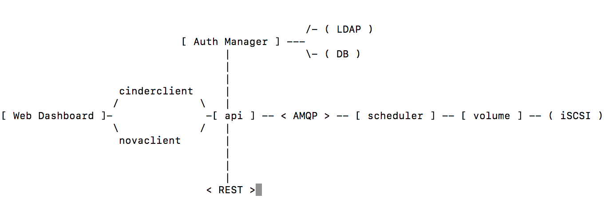
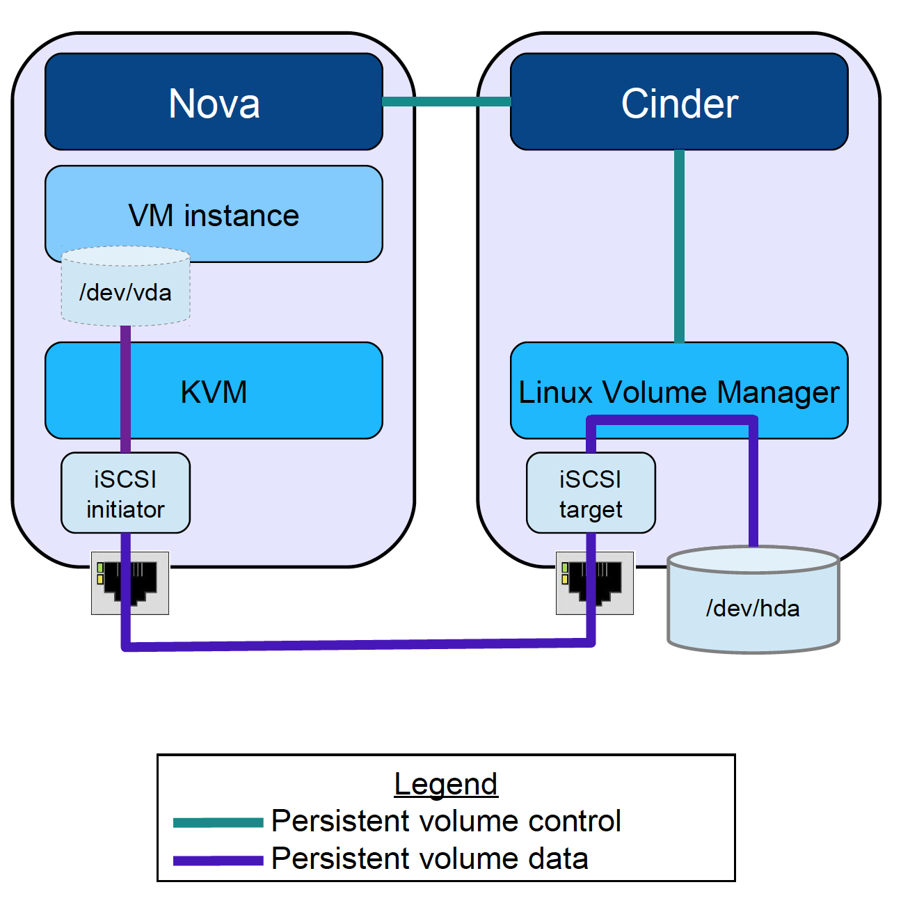

# Cinder
## 关于存储
  - 存储是OpenStack所管理的最重要的资源之一。
  - Nova实现了OpenStack虚拟机世界的抽象，并利用主机的本地存储作为虚拟机的“临时存储（Ephemeral Storage）”。
  - 基于SAN，NAS等不同的类型的存储设备，Swift（对象存储）与块存储（Cinder）引入了“永久存储（Persistent Storage）”
    - SAN
      - 存储区域网络（Storage Area Network，简称SAN）采用网状通道（Fibre Channel ，简称FC，区别与Fiber Channel光纤通道）技术，通过FC交换机连接存储阵列和服务器主机，建立专用于数据存储的区域网络。（http://baike.baidu.com/item/存储区域网络/6091260?fromtitle=SAN&fromid=10789152）
    - NAS
      - NAS被定义为一种特殊的专用数据存储服务器，包括存储器件（例如磁盘阵列、CD/DVD驱动器、磁带驱动器或可移动的存储介质）和内嵌系统软件，可提供跨平台文件共享功能。（http://baike.baidu.com/link?url=_Jt-piYvwJ3lvkJbzpKmXcziG6BzeByF16zOc1BjV0-d3m5kJXK4WFUuOHRdqVPPlbRgYWVEPetvUYlBZwIfAq）
    - 对象存储
      - Object storage (also known as object-based storage[1]) is a computer data storage architecture that manages data as objects, as opposed to other storage architectures like file systems which manage data as a file hierarchy and block storage which manages data as blocks within sectors and tracks.[2] Each object typically includes the data itself, a variable amount of metadata, and a globally unique identifier. （https://en.wikipedia.org/wiki/Object_storage）
      - 对象存储是无层次结构的数据存储方法，通常用于云中。不同于其他数据存储 (英文) 方法，基于对象的存储不使用目录树。各个单独的数据（对象）单元存在于存储池中的同一级别。每个对象都有唯一的识别名称，供应用进行检索。此外，每个对象可包含有助于检索的元数据。（https://www.ibm.com/cloud-computing/cn-zh/object-storage/）
      - 适合存放静态数据（长期不会发生更新的数据）
    - 块存储
      - 块是一个字节序列（例如，一个512字节的数据块）。基于块的存储接口是最常见的存储数据方法，它们基于旋转介质，像硬盘、 CD 、软盘、甚至传统的 9 磁道磁带。基于块设备的存储方式，定义为块存储。（http://docs.ceph.org.cn/rbd/rbd/）
      - 适合存放需要实时更新的数据

## 历史
  - Cinder的前身是Nova中的nova-volume服务，在Folsom版本发布时，从Nova中剥离作为一个独立的OpenStack项目存在。

## 功能
- 与Nova利用主机本地存储为虚拟机提供的临时存储不同，Cinder为虚拟机提供**持久化的**块存储能力，实现虚拟机**存储卷（Volume）的创建、挂载、卸载、快照等生命周期管理**。

## 结构
- overview
  
  - DB: sql database for data storage. Used by all components (LINKS NOT SHOWN).
  - Web Dashboard: potential external component that talks to the api.
  - api: component that receives http requests, converts commands and communicates with other components via the queue or http.
  - Auth Manager: component responsible for users/projects/and roles. Can backend to DB or LDAP. This is not a separate binary, but rather a python class that is used by most components in the system.
  - scheduler: decides which host gets each volume.
  - volume: manages dynamically attachable block devices.

- cinder如何为nova提供Volume
  
  - iSCSI
  OSI七层模型中，iSCSI属于传输层协议，规定了iSCSI Target和iSCSI Initiator之间的通信机制。

- 实现方法
  - Cinder本身不直接提供块存储设备实际的管理和服务，而是在虚拟机和具体的存储设备之间引入一个抽象的“逻辑存储卷”。Cinder通过添加不同厂商的Driver来整合后端存储设备，并通过提供统一的API接口的方式为云平台提供持久性的块存储服务，类似于Amazon的EBS（Elastic Block Storage）。
- 核心模块
  - cinder-client（作为开端，非核心模块）
    - cinder命令的可执行文件，将用户命令转换位标准的HTTP请求
  - cinder-api
    - 提供RESTful API接口的统一卷管理接口，其主要功能是接受客户端发来的HTTP请求，然后进行用户身份认证和消息分发。Cinder API本质是一个WSGI App，启动Cinder API服务相当于启动一个名为osapi_volume的WSGI服务去监听Client的HTTP请求。实现上主要依赖WSGI服务器、WSGI App、Paste Deploy和路由器技术。
  - cinder-volume
    - 运行在存储节点上管理具体存储设备的存储空间，每个存储节点上都会运行一个cinder-volume服务，多个存储节点构成存储资源池。
    - Volume生命周期管理的真正实现模块。
      - manager.py是cinder-volume最为核心的代码，其中的VolumeManager类用于执行接收到的RPC请求，包含所有有关Volume的生命周期管理的函数都。
  - cinder-scheduler
    - 根据预定的策略选择合适的cinder-volume节点来处理用户的请求。
  - cinder-backup
    - 用于提供卷的备份功能，支持将块存储设备备份到OpenStack备份存储后端，如Swift、Ceph、NFS等。

## 其他
- 对象存储

- 相关主题
  - [参考 【OpenStack 存储剖析】 ](https://www.ibm.com/developerworks/cn/cloud/library/1402_chenhy_openstackstorage/)
  - [参考 【Cinder System Architecture】](https://docs.openstack.org/developer/cinder/devref/architecture.html)
  - 参考 【OpenStack设计与实现（第二版）】
  - 参考 【OpenStack系统架构设计实战】
